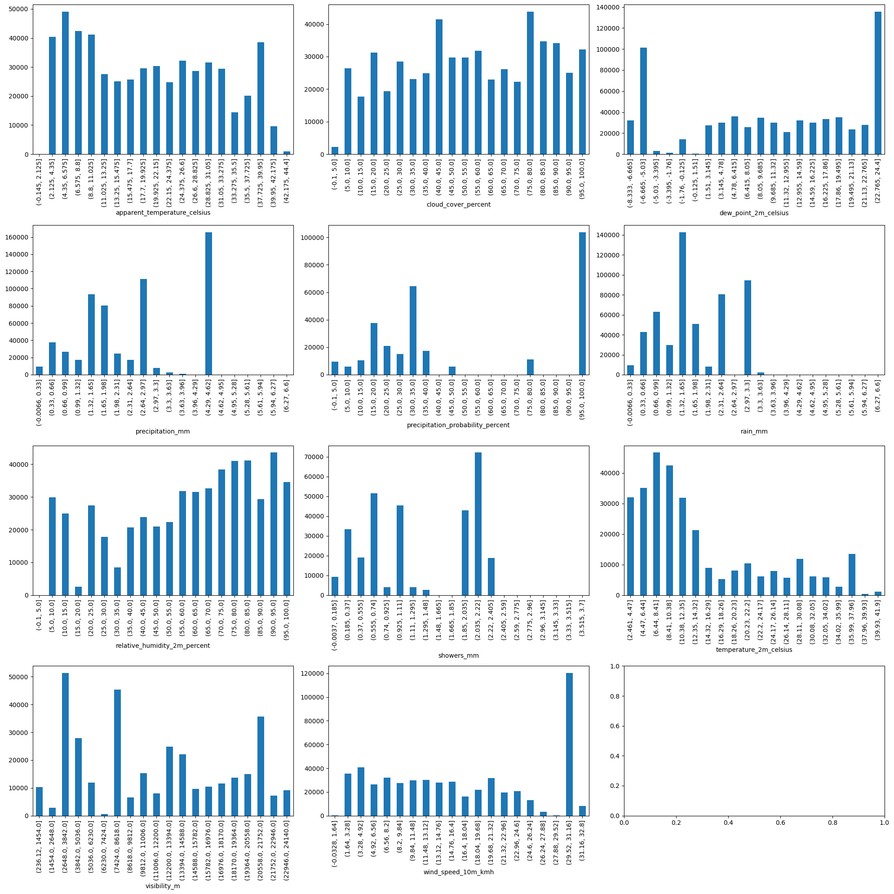

---
header-includes:
  - \usepackage{float}
  - \floatplacement{figure}{H}
  - \usepackage[export]{adjustbox}
  - \let\includegraphicsbak\includegraphics
  - |
    \renewcommand*{\includegraphics}[2][]{%
      \includegraphicsbak[frame,keepaspectratio,max width=\textwidth,#1]{#2}%
    }

geometry: margin=0.75in
papersize: a4paper
fontsize: 11pt
wrap: none
mainfont: "Liberation Serif"
sansfont: "Liberation Sans"
monofont: "Hack"
---

# Hospitality Sales: A Deep Dive - Part I

## Introduction
This series of articles is a semi-formal walkthrough exploring some of the very intricate and colourful dynamics of hospitality (hospo), especially food and beverage (F&B). All data sourced is proprietary.

Much of the R&D undertaken at Quantaco aims to address one simple question: _how can we improve the efficiency of hospitality operations?_ One of the main drivers of efficiency comes from the optimisation of labour costs, which itself has a strong dynamic with sales. One of the many beauties of a dynamic system is emergent phenomena, and we can see this in hospo's immense reflection of human behaviour through sales; as such, optimising hospitality ops requires cultivating a good understanding of sales, how patrons' behaviour over time shapes the industry, and in turn how the industry shapes patrons' behaviour (General Relativity, anyone?).

At Quantaco, we support multiple venues and have, at any given time, around 150 active ones that depend on our analytics. Each venue has at least one area within it and sells in at least 2 categories, food and beverage, yielding a lower bound estimate of 300 distinct time series, each with their own unique signature ripe for study. The effective modelling of hospitality sales is therefore quite vital given the depth of the industry, and equivalently vital is the automation of feature discovery across our datasets. To facilitate analytics at scale, a rigorous approach is mandatory, and this is the point of our discussion here.

For our analysis, we will look at one time series dataset containing weather and sales, all sampled hourly, and spanning around 2 years (2023 March to 2025 May). As and when required, examples to the contrary of our conclusions will be provided for orientation. We will be touching on some amount of applied mathematics from subjects like signal processing, dynamic systems theory, time series analysis and linear algebra.

In this series of articles, we'll take a tour of hospitality sales through the lenses of copulae, spectral analyses, and Lyapunov exponents. Part I introduces the dataset and explores the relationships between weather and sales. Part II focuses on the behaviour of sales itself through classical pole/zero and FFT diagnostics. Part III dives into the complex plane and explores sales through its intricate spectra via higher order methods like bispectra and coherence. Part IV wraps it up with some concluding points for sales modelling, and highlights results we at Quantaco have witnessed as a result of this analysis.

### Broad Strokes
Briefly, in this part we're going to cover:
1. Dataset EDA.
2. Copulae.
3. Pearson Correlation Heatmap.
4. Variance Inflation Factor.
5. Pivoted QR.
6. Nonlinear feature inspection.

## Dataset EDA
Let's begin with having a look at the kind of data we're dealing with. Note that this data has already been cleaned, so what we're seeing here is data primed for analysis.

Obvious conclusions aside, we have two points to note:
1. There are a lot of weather regressors to juggle.
2. `precipitation_probability_percent` is an incomplete column with mostly zeroes, so we can safely ignore this from all subsequent analysis.

We can turn to some elementary mathematics to help us discern which ones actually matter, and which ones don't. For starters, a scatterplot should help us see the kinds of relationships we're dealing with betwixt weather and sales.

We can see some mild linearity between `apparent_temperature_celsius`, `dew_point_2m_celsius`, `relative_humidity_2m_percent`, `temperature_2m_celsius` and sales (`y`), and some relationship between these regressors as well. For example, apparent temperature and relative humidity look like their densities are on opposite sides of the graph, with dew point's density being right in the middle of the two. The precipitation gang, i.e. features `precipitation_mm`, `rain_mm` and `showers_mm` appear to have their maximal sales happen at a value of 0, and then a significant reduction in sales as their values increase. Some of these columns might seem linear as well, but we'll let the data speak for itself. One of the stages we'll provide for it to let its voice out is the humble copula.

## Copulae
Recall that a copula show us the joint effects of two variables whilst removing their individual marginal effects. For example, if we were baking bread, we'd pay attention to, say, the temperature of the oven and how long we keep the bread in there for. Both temperature and time have individual effects on how well the bread turns out (the temperature affects the cooking speed, and the time affects how much the dough rises and browns). If we plot temperature vs. time on their own as a scatterplot, we might see that at higher temperatures, the bread browns faster, and at longer baking times, the bread rises more. However, these two effects are kind of isolated. What a copula plot would do is depict just the relationship between temperature and time in terms of how they work together to affect the bread's outcome (e.g., crispiness, rise, texture). It ignores things like "how high the temperature is" or "how long the time is" in isolation, and instead focuses purely on how the combination of both affects the outcome.

For a more rigorous breakdown, let's begin with assuming two random variables (like baking temperature and rise time) $X$ and $Y$ have continuous _marginal_ CDFs $F_X$ and $F_Y$. By Sklar's Theorem, any joint distribution $F_{X,Y}(x,y)$ can be written as:
$$ F_{X,Y}(x,y) \;=\; C\big(F_X(x),\,F_Y(y)\big) $$

Where $F_X$ and $F_Y$ are the marginal CDFs and $C(u,v)$ is the copula function on $[0,1]^2$.  The density version is:
$$ f_{X,Y}(x,y) \;=\; c\big(F_X(x),\,F_Y(y)\big)\;f_X(x)\;f_Y(y) $$

So if we transform each observation to its marginal CDF value (i.e. to the rank-based pseudo-observation) - in other words, if we simply rank our data - then the joint density of those pseudo-observations (our ranked data) is exactly the copula density $c(u,v)$ - meaning simply ranking our data and computing the ranked percentiles gives us our copula density. Programmatically then, we:

1. **Compute ranks.**
  For each observation $x_i$ in our sample $\{x_1,\dots,x_n\}$,

  $$ \widehat{F}_X(x_i) = \frac{\text{rank}(x_i)}{n+1} \quad \in(0,1). $$

  Where $\frac{\text{rank}}{(n+1)}$ is the empirical CDF value at $x_i$.
2. **Do the same** for $y_i$.
3. **Plot or estimate** the density of the 2-dimensional points

  $$ \bigl( \widehat{F}_X(x_i),\, \widehat{F}_Y(y_i)\bigr) \quad i=1,\dots,n. $$

  A bivariate KDE on these points is just a smooth estimate of $\;c(u,v)$, i.e. the copula density.

Let's try a small worked example from quant to see what's actually going on. Let's take some market price changes over time and a random portfolio that changes in accordance with the market, to get this kind of dataset:

| Market    |-1.10  | 0.26  | 0.53 | -1.00 | 1.59 | 1.00 | 0.75 | -0.10 | 0.15 |
| :-------: | :---: | :---: | :--: | :---: | :--: | :--: | :--: | :---: | :--: |
| Portfolio | -2.00 | -0.56 | 0.75 | -2.00 | 3.67 | 1.59 | 0.84 |  0.00 | 0.00 |

To compute our copula, we'd first sort and rank both columns:

| market | portfolio | sorted_mkt | rank | sorted_pf | rank |
| :----: | :-------: | :--------: | :--: | :-------: | :--: |
|  -1.10 |     -2.00 |      -1.10 |    1 |     -2.00 |    1 |
|   0.26 |     -0.56 |      -1.00 |    2 |     -2.00 |    2 |
|   0.53 |      0.75 |      -0.10 |    3 |     -0.56 |    3 |
|  -1.00 |     -2.00 |       0.15 |    4 |      0.00 |    4 |
|   1.59 |      3.67 |       0.26 |    5 |      0.00 |    5 |
|   1.00 |      1.59 |       0.53 |    6 |      0.75 |    6 |
|   0.75 |      0.84 |       0.75 |    7 |      0.84 |    7 |
|  -0.10 |      0.00 |       1.00 |    8 |      1.59 |    8 |
|   0.15 |      0.00 |       1.59 |    9 |      3.67 |    9 |

Then with these ranks, we can compute our percentiles up to $n+1$:

| ranked_market | percentiles | ranked_portfolio | percentiles |
| :-----------: | :---------: | :--------------: | :---------: |
|             1 |         0.1 |                1 |         0.1 |
|             5 |         0.5 |                3 |         0.3 |
|             6 |         0.6 |                6 |         0.6 |
|             2 |         0.2 |                1 |         0.1 |
|             9 |         0.9 |                9 |         0.9 |
|             8 |         0.8 |                8 |         0.8 |
|             7 |         0.7 |                7 |         0.7 |
|             3 |         0.3 |                4 |         0.4 |
|             4 |         0.4 |                4 |         0.4 |

And we can see here clearly that our portfolio's joint distribution moves completely in sync with the market, meaning it's heavily, heavily correlated with the broader market. One small thing to note here is that we always sort descending because we want the most negative number to get the first rank (i.e., only 1 thing is below this tiny value). Likewise the most positive (almost everything is below this massive value). Since our portfolio is perfectly associated with the market, the empirical copula mass will be all along the diagonal $u=v$ (we'd just get a 45° line if we plot this). A KDE on these points would concentrate density along that line; just like what we see if we send in `y, y` into the copula plotting function.

An important point to note through all this is that copulae - especially our empirical rank approach - [are extremely sensitive to certain univariate dynamics](https://en.wikipedia.org/wiki/Copula_(statistics)#Stationarity_condition) like autocorrelation, trends and seasonality. The copula between two semi-correlated sine waves with noise will be very, very different from the copula between those two waves after the seasonality (sinusoidal behaviour) has been removed; the latter depicts the pure codependence and mixing betwixt the two without univariate influence (having been "whitened"). We'll touch upon a more concrete explanation of what this actually means later on in Part II; for now, just know that we have here our _whitened_ copulae from our data. Behold!

Our copula shows us an immense amount of interesting behaviour between sales and weather. For example:
1. Almost all of our weather regressors have a strong monotonic relationship with sales except for temperature and visibility.
2. Apparent temperature, cloud cover, dew point, relative humidity, and wind speed all have the same (if not a very similar looking) copula - implying they're probably heavily correlated amongst themselves too.
3. The majority of visibility's density shows an inverse-monotonic association with sales.
4. The copulae of visibility and temperature are relatively smeared, with the majority of visibility's density lying along a -45° line. This means that regardless of temperature and visibility, we have beverage sales, which checks out; and that the lower the visibility, somewhat lower the sales, which also checks out.
5. The precipitation bunch (precipitation, rain, showers) all have the same copula _and_ seem to have a _monotonic relationship with sales_. Having the same copula implies they're probably heavily correlated, but the fact that we see a linear relationship between the joint distributions here that we didn't see from the scatterplot is an interesting clue. Recall that `precipitation_probability_percent` is mostly zero, so we're ignoring that one.

At this stage, what we can draw from this is that yes, we do have dependencies between sales and weather, and we also most likely have collinearity betwixt our weather columns. However, it pays to note that copulae will arise that show highly nonlinear and sometimes inconclusive relationships between regressors. For example, consider these 2 copulae from 2 different time series (organised the same way: weather regressors on the x-axis, sales on the y-axis, and weather columns in the same arrangement as well):

The variety in these copulae just goes to show how much of an influence weather has on retail hospitality. Regardless, we know what we have in store for our data. The first thing we want to do is tease out the intra-regressor relationships between weather only to arrive at an orthogonal dataset we can use to model sales with.

## Pearson Correlation
As a quick note, lest we forget: when we z-standardise `X` and `y` and then fit a least squares line to their relationship (OLS), that's equivalent to correlation. From $y = mx + b$, once we standardise both variables are mean zero, so $b=0$ implying $m$ captures all linear dependency:
$$
  Z_X = \frac{X - \bar{X}}{\sigma_X}; ~~ Z_y = \frac{y - \bar{y}}{\sigma_y}
  \implies Z_y = m \cdot Z_X + b
$$

Since $b=0$, we get:
$$ b = 0; ~~ m = \frac{\text{Cov}(Z_X, Z_y)}{\text{Var}(Z_X)} $$

And since $Z_X$ is standardised, $\text{Var}(Z_X) = 1$ and $\text{Cov}(Z_X, Z_y) = \text{Corr}(X, y)$ because $\sigma_{X, y}$ is also now zero:
$$ \text{Corr}(X, y) = \frac{\text{Cov}(X, y)}{\sigma_X \sigma_y} = \text{Cov}(Z_X, Z_y) $$

Linear regression estimates how much $Z_y$ changes per unit change in $Z_X$. Since both variables are now unitless with mean zero, this change is entirely driven by their co-movement, i.e., correlation. That being said, we have our data's correlation heatmap:

Which is quite interesting! Pearson correlation - standardised OLS - shows us an _almost zero_ amount of $\rho$ between our 4 precipitation columns, but the copula shows us a strong monotonic dependence with a concentrated diagonal - _because copulae capture any kind of dependence_: nonlinear, tail, asymmetry; which is also why they're so ubiquitous in quant. In other words, we have a nonlinear relationship between the precipitation bunch and sales, clear as day. To point this out concretely, the Pearson correlation does this:
$$
    \rho_{X,Y} = \frac{\mathrm{Cov}(X,Y)}{\sigma_X\,\sigma_Y}
    = \frac{\mathbb{E}[(X - \mu_X)(Y - \mu_Y)]}{\sqrt{\mathbb{E}[(X - \mu_X)^2]}\,\sqrt{\mathbb{E}[(Y - \mu_Y)^2]}}
$$

It's completely - by nature - insensitive to nonlinear dependencies, and more importantly, is affected by marginal distributions (e.g. heavy tails and outliers can unduly distort $\rho$). A copula, on the other hand, is a joint CDF of the rank-transformed variables, and does this:
$$
    C(u,v) \;=\; P\bigl(F_X(X)\le u,\;F_Y(Y)\le v\bigr),
    \quad u,v\in [0,1]
    \implies c(u,v) \;=\; \frac{\partial^2C}{\partial u \partial v}
$$

Where $F_X$ and $F_Y$ are the marginal CDFs of $X$ and $Y$. This thing captures the entire dependence structure (tail dependence, asymmetries, and nonlinear patterns) between $X$ and $Y$, separate from their margins. In fact, different copula families (Gaussian, Clayton, Gumbel, etc.) emphasise different aspects of dependence (e.g. upper-tail vs lower-tail), and Spearman's rank correlation and Kendall's $\tau$ are _functionals_ of the copula:
$$
    \rho_s = 12 \int_0^1\!\!\int_0^1 \bigl(C(u,v) - uv\bigr)\,du\,dv,
    \quad
    \tau = 4 \int_0^1\!\!\int_0^1 C(u,v)\,dC(u,v) \;-\;1.
$$

Which now just begs the question - in addition to "which linear weather regressors do we keep" - what exactly is the nonlinear structure of our relationship here? Let's tackle the former question first and focus on whittling down our linear weather regressor set to a few orthogonal columns that best help describe the sales. We're only looking at apparent temperature, cloud cover, dew point, relative humidity and wind speed. It's interesting here too because given the correlations between weather variables themselves, the $\rho$ ~ `y` is also inflated.

## Variance Inflation Factor
To paraphrase the definitions of VIF from [Wikipedia, which also has a sweet calculation example](https://en.wikipedia.org/wiki/Variance_inflation_factor#Calculation_and_analysis), and [statsmodels](https://www.statsmodels.org/dev/generated/statsmodels.stats.outliers_influence.variance_inflation_factor.html), the VIF quantitatively measures how much the variance of each coefficient is inflated due to multicollinearity. The reason is because when we have collinear columns in our design matrix `X` and we regress for `y`, the variance of our regression coefficients for columns that are collinear increase a lot (the regression becomes unstable). When we don't have collinear columns, our coefficients are stable. VIF quantifies this relationship. To quote the example on Wikipedia:
1. Start with regular OLS, regressing one of the columns in $X$ against all the other columns in there:
  $$ X_1 = \alpha_0 + \alpha_2 X_2 + \alpha_3 X_3 + \dots + \alpha_N X_N + \varepsilon $$

2. Calculate the VIF for $\hat{\alpha_1}$ like so, where $R_i^2$ is the coefficient of determination of the regression equation from step one:
  $$ \text{VIF}_1 = \frac{1}{1 - R_1^2} $$

3. Analyse the magnitude of multicollinearity by considering the size of $\text{VIF}(\hat{\alpha_1})$. A rule of thumb is that if VIF>10, multicollinearity is high. However, there is no value of the VIF greater than 1 in which slope variances aren't inflated at all, so including two or more variables in a multiple regression that are not perfectly orthogonal will alter each other's slope, standard error of the slope, and P-value, because there is shared variance between the predictors that can't be uniquely attributed to any one of them.

The square root of the VIF indicates how much larger the standard error increases by, compared to if that variable had 0 correlation to the other predictor variables in the model. This helps us narrow down the columns in our weather dataset to ones that are orthogonal to one another; note that VIF doesn't consider `y`, so the VIF-based ordering of our weather columns is consistent across time series:

| feature                           | VIF           | std_err     |
| --------------------------------: | ------------: | ----------: |
| precipitation_mm                  | `2231.268192` | `47.236302` |
| rain_mm                           | `1231.902712` | `35.098472` |
| showers_mm                        |  `656.059502` | `25.613659` |
| visibility_m                      |   `20.672564` |  `4.546709` |
| temperature_2m_celsius            |   `20.249757` |  `4.499973` |
| dew_point_2m_celsius              |   `19.982955` |  `4.470230` |
| apparent_temperature_celsius      |   `16.271619` |  `4.033809` |
| relative_humidity_2m_percent      |    `9.359356` |  `3.059306` |
| cloud_cover_percent               |    `4.958181` |  `2.226697` |
| wind_speed_10m_kmh                |    `4.324295` |  `2.079494` |
| precipitation_probability_percent |    `1.210216` |  `1.100098` |

We can see from here that we have 3 distinct clusters of features: the precipitation bunch, from a standard error of 25 upwards; humidity, from 3 upwards to 24; and wind, $\approx 2$. We want to take, out of these columns in this order, a set of regressors that are minimal in VIF (since we have clusters, we can say that we want the within-cluster infimum) and have the greatest relationship (supremum) with `y` (as given by $\rho$, Pearson correlation). Let's go in descending order from $\rho_y$:
- Relative humidity ($\rho_y=0.58$) is, in fact, the infimum in terms of VIF standard error (3.0593), so we're keeping that. This feature is also correlated with apparent temperature ($\rho_y=0.50, \rho=0.83$), cloud cover ($\rho_y=0.48, \rho=0.85$), dew point ($\rho_y=0.51, \rho=0.89$) and wind speed ($\rho_y=0.45, \rho=0.75$); and also has a sufficiently linear copula with sales. This choice now reduces our set tremendously to just the precipitation bunch, visibility, and `temperature_2m_celsius` (aka "temperature", in contrast to "apparent temperature"). Recall that `precipitation_probability_percent` is mostly zero, so we're ignoring that one.
- Between visibility and temperature, the infimum is `temperature_2m_celsius`, however with $\rho=-0.13$ and a rather complicated copula, this feature is probably not going to be of direct assistance as of now. We can safely ignore this entire bunch, leaving us only with the precipitation group.
- Out of `precipitation_mm`, `rain_mm` and `showers_mm`, the infimum is `showers_mm` - and this has a good copula too. So as of now, we'll go with `showers_mm`. We've yet to discern what the nonlinearity is, though.

We have a decent regressor set as of now: `["relative_humidity_2m_percent", "showers_mm"]`. But before we proceed however, that little quip about _"a VIF of > 10 signals high multicollinearity"_ sure sounded like _"the design matrix is skewed by a factor of 10 in a single dimension"_, or that there was some hidden relationship between the VIF and the condition number. And sure enough, there is!

### The VIF
We start with the correlation-scaled design matrix:
$$ Z = XW^{-1} $$

Where $X$ is the design matrix and $W$ is the diagonal matrix of each columns' standard deviation. Then if we were to do $Z^TZ$, we get $R$; the predictors' correlation matrix. To break this down as to why, if $Z$ is the design matrix with each column z-standardised, then recall that when you do any transposed matrix times itself (dot product), you're doing:
$$ Z^TZ = \begin{bmatrix} Z^T_1 Z_1 & Z^T_1 Z_2 & \dots\\ Z^T_2 Z_1 & Z^T_2 Z_2 & \dots\\ \vdots & \vdots & \ddots \end{bmatrix} $$

Where $Z^T_i \cdot Z_i$ is the dot product between the rows and columns in $Z$. Recall that the inner product product $\langle Z_i ,Z_j \rangle$, in linear algebra terms, gives you a measure of how much one vector lies in the direction of another; a sense of collinearity, or the angle betwixt them. As such, doing this for a z-standardised design matrix gives you the Pearson correlation between each feature (how much of $Z_j$ lies in the column-space direction of $Z_i$), here called $R$. $R$'s eigendecomposition is given by:
$$ R = V \Lambda V^t \qquad \Lambda = \text{diag}(\lambda_1, \dots, \lambda_p) $$

Where $\Lambda$ contains the eigenvalues of $R$ and $V$ the corresponding orthonormalised eigenvectors of $R$ (i.e., $V$ is orthogonal). Now, it's important to assert that $0 \le \lambda_min \leq \dots \leq \lambda_max$ because the eigenvalues in $R$ represent the variance captured along each eigenvector $v^k$. Since $R$ is positive-definite (all diagonal entries are 1 - is the hallmark of a correlation matrix - and no nontrivial linear combination of its columns can be zero unless the data is perfectly collinear), the eigendecomposition itself guarantees that all eigenvalues are strictly positive. If our data was collinear, then from fundamental linalg theory, we'd get a 0 or near-zero eigenvalue indicating dependency amongst columns and that $R$ is singular or ill-conditioned.

Now, since $R^{-1} = V \Lambda^{-1} V^T$, the diagonal entries of $R^{-1}$ are exactly the VIFs:
$$ \text{VIF}_i = \left[ R^{-1} \right]_{ii} = \sum \limits_{k=1}^{p} \frac{v^2_{ik}}{\lambda_k} $$

Where $v_{ik}$ is the $i$th entry of the $k$th eigenvector, so the sum over $k$ over all $v^2_{ik}$ is 1, or $\sum \limits_{k} v^2_{ik} = 1$. As for why we're inverting only $\Lambda$, recall from fundamental linalg that:
- $V$ is orthogonal, so $V^{-1} = V^T$. There's no need to invert $V$ beyond taking its transpose, and
- $\Lambda$ is diagonal with entries $\lambda_k$, so $\Lambda^{-1}$ is the diagonal matrix whose entries are simply 1/$\lambda_k$. The conceptual and computational burden of matrix inversion reduces to only inverting the eigenvalues in $Lambda$ whilst the orthogonal geometry is preserved by the surrounding $V$ and $V^T$.

But what does it actually *mean* for us to compute $R^{-1} = V \Lambda^{-1} V^T$? What are actually doing here with our correlation matrix? Well, recall that matrix inversion involves simply "undoing" what the original matrix transformation did; in this case we can see that we're inverse-scaling $\Lambda$, so in this case we're scaling each eigenvector by the inverse of how much variance lies in it; we're scaling each eigenvector by the inverse of its eigenvalue. Large eigenvalues become tiny (the most orthogonal features in the original $R$ become very small) and the smallest eigenvalues become large (the least orthogonal, the most linearly dependent, features become very large). The large entries are the VIFs.

### The Condition Number
The condition number of any matrix $Z$ is given by:
$$ \kappa(Z) = \frac{\sigma_{\text{max}}(Z)}{\sigma_{\text{min}}(Z)} = \sqrt{\frac{\lambda_{\text{max}}}{\lambda_{\text{min}}}} $$

### The Inequality
And now notice: since for $i$ and $k$ in the VIF, we have:
$$ \frac{v^2_{ik}}{\lambda_k} \leq \frac{v^2_ik}{\lambda_{\text{min}}} $$

Because of course every *other* feature scaled by the inverse of every other eigenvalue must be smaller or equal to the inverse of the smallest eigenvalue! So naturally then:
$$ \text{max VIF}_i \leq \sum \limits_k \frac{v^2_{ik}}{\lambda_{\text{min}}} = \frac{1}{\lambda_{\text{min}}} = \frac{\lambda_{\text{max}}}{\lambda_{\text{min}}} = \kappa(Z)^2 $$

Or, the square of the condition number is an upper bound on the largest VIF. The VIFs measure how much variance of each coefficient is inflated by (near-)linear dependencies amongst the other regressors, via the inverse correlation matrix. The condition number measures the overall ill-conditioning of `X` via the ratio of its largest to smallest singular values, equivalent to the eigenvalues of $X^TX$. Thus, very small eigenvalues of $X^TX$ (high $\kappa$) force large VIFs, and large VIFs signal that $\lambda_{\text{min}}$ is tiny and the condition number is large.

And finally, to cover how $v^2_{ik} = 1$ in the final inequality, since V is orthogonal and contains orthonormal eigenvectors, for each fixed $i$:
$$ \sum \limits_{k=1}^p v^2_{ik} = v_i \cdot v_k = 1 $$

For more reading, [Gomes (2018) spoke about this](https://www.tandfonline.com/doi/abs/10.1080/00949655.2018.1463376) as well. It's also important to note through all this that VIF is based on OLS, and as such, is also a linear model (i.e., will miss nonlinear relationships).

## Pivoted QR
Before we decide on our regressor set via Pearson correlation and VIF however, there is one more test I'd like to run. I'd like to see what columns actually bring in the most information into the span of our regressor set **without** lazily throwing a bunch of ML models at this data. The reason for this check is because sure, we might see good correlation _and_ joint distribution behaviour between, say, showers and sales, but what if showers doesn't actually help inform sales? What if showers doesn't help inform anything and these two just happened to move together; what if actual predictive power lies elsewhere? To this end, we can leverage pivoted QR.

Recall that QR also gives us an orthonormal space just like SVD, except SVD gives us a globally optimised eigenspace (if we do it on the covariance matrix, we capture the maximum covariance possible) - there is one simultaneous spectral solution. QR on the other hand is a greedy algorithm based off Gram-Schmidt orthonormalisation; it just adds those columns to the solution space that stick out the most _after_ subtracting the span of what's already been chosen. Regular QR gives us $Q^{n \times 6}$ orthonormal columns (i.e., $Q^TQ = I$). $R^{6 \times 6}$ is like $\sigma$ in SVD, it's a square eigenvalue matrix that tells us how much each orthonormal vector in $Q$ contributes to rebuilding our data (i.e., $R_{ij}$ tells us how much of the $j$th orthonormal direction contributes when we rebuild column $i$). Concretely, the diagonal entries $R_{ii}$ are the lengths of the residuals when we orthogonalise the $ii$th original column against all the earlier ones. For example:
1. Take column 1 of `weather_data`; its length is $||a_1||$. That becomes $R_{11}$, and $q_1 = \frac{a_1}{R_{11}}$.
2. Project column 2 onto $q_1$, subtract off that piece, and measure the remainder's length $||r_2||$: that's $R_{22}$, and gives us $q_2 = \frac{r_2}{R_{22}}$
3. Project column 3 onto $q_2$, subtract off that piece, and measure the remainder's length $||r_3||$: that's $R_{33}$, and gives us $q_3 = \frac{r_3}{R_{33}}$
4. Etc.

Like SVD, if $R_{ii}$ is large, then that column brought new information into the dataset. If it's small, its information is already mostly contained in the previous span. Pivoted QR simply says: "At each step, pick the as-yet-unused column that gives the largest residual norm." From all of this, one should also be able to surmise that QR is also linear. For our weather data, we have this kind of organisation (this too is independent of y, so this ordering is consistent across datasets):

| column                            | R              |
| --------------------------------: | -------------: |
| visibility_m                      | `3129708.0000` |
| cloud_cover_percent               |    `4059.1500` |
| relative_humidity_2m_percent      |    `1915.0970` |
| temperature_2m_celsius            |     `726.1736` |
| apparent_temperature_celsius      |     `569.6790` |
| precipitation_probability_percent |     `402.3817` |
| wind_speed_10m_kmh                |     `369.8246` |
| dew_point_2m_celsius              |     `177.1005` |
| precipitation_mm                  |      `22.5041` |
| showers_mm                        |       `9.6024` |
| rain_mm                           |       `0.5361` |

Here, we're looking to select the columns that bring the most amount of information into the span of our regressorset. Basically, the bigger the |R|, the better the column _should_ be. Out of our regressor set, we can see that relative humidity is quite up there, so that's alright (recall we're ignoring apparent temperature ($\rho=0.50$), cloud cover ($\rho=0.48$), dew point ($\rho=0.51$) and wind speed ($\rho=0.75$); and we're selecting relative humidity because between the linear columns, it has the lowest VIF). We're also ignoring temperature and visibility because their copula and Pearson correlation respectively are not quite confidence inducing. We're also ignoring precipitation probability because it's mostly zero; all of this leaves us with the precipitation bunch. Out of these 3, precipitation, showers, and rain, precipitation actually brings in $\frac{22.50}{9.60} -1 \approx 1.34375$ times more information that showers does. We're better off replacing showers with precipitation, making our final set `["relative_humidity_2m_percent", "precipitation_mm"]`.

Now with all of our linear analysis out of the way, we can proceed into looking at the kind of nonlinearities we have. For this analysis, we'll focus more on our nonlinear columns (`precipitation_mm`, `rain_mm`, `showers_mm`).

## Nonlinear Analysis
Let's take this slow, starting from the scatterplot itself where we have our raw data. All that that tells us is, quite simply, "we have a lot of sales when there's no rain". Pretty obvious, right? But notice: there's a very significant dependence between this rain column and our sales (as our copula shows). All we know is that we have a lot sales when rain is minimal, and a little sales towards maximal rain. Of course we can use this relationship, but we need some way to linearise it. To this end, we have two easy approaches:
1. Bin `precipitation_mm` into some arbitrary $N$ bins, and add each bin as a regressor. Say 20 bins, and we use labels like `"rain_0.25mm"`, `"rain_0.50mm"`, `"rain_0.75mm"`, all the way up to whatever the maximum bin value is. This lets us qualitatively handle precipitation, but if we include this as a regressor set in any model, we are at a big risk of blowing up our condition number since adjacent bins are correlated.
2. Since we have most of our sales values at a regressor value of $0$, we can use something like `np.log1p` or `np.sqrt` to smoothen out our regressor and linearise it a little. This helps any downstream model use a continuous regressor, and we get a reduction in condition number - though we sacrifice explicitness.

Let's explore both.

### Discretised Weather
The way we do this is very simple: we simply use `pd.cut` to discretise our feature into, say, 20 bins, and then `groupby` each bin and compute a variance over `y` (sales). This gives us the variance of sales within each bin.

This is a great representation of our data, and we can see 3 distinct bins in precipitation: the first 4 bins have minimal sales variance, the next 4 have a significantly higher amount of variance compared to the first one, and the remaining bins have even higher amounts of variance versus the 2nd group. 3 to 4 bins should be sufficient to capture a linearised version of the relationship betwixt sales and precipitation, but we'd be remiss if we didn't consider how a log transform would help, and the fact that adjacent bins are correlated.

### Log Transformations

After linearising we get a much better representation of the precipitation bunch, though `precipitation_mm` is still a little scrunched up towards the corner. Trying to use this to model sales would naturally give us a -45° line, which is sufficient at this stage. But still, why not just use a discretised & binned regressor? How are adjacent bins correlated? Well, let's break this down a little bit:
1. For each bin $i$, define
   $$
     D_i =
     \begin{cases}
       1 & \text{if precipitation falls in bin } i,\\
       0 & \text{otherwise.}
     \end{cases}
   $$

2. Because of mutual exclusivity, no observation can lie in two different bins simultaneously, so that gives us
   $$
     D_i\,D_j = 0,\quad \forall\,i \neq j.
   $$

4. Now we compute the covariance per bin:
   $$
     \mathrm{Cov}(D_i, D_j)
     = \mathbb{E}[D_i D_j] - \mathbb{E}[D_i]\;\mathbb{E}[D_j]
     = 0 - p_i\,p_j
     = -\,p_i\,p_j,
   $$

   where $p_i = \mathbb{E}[D_i]$ is the marginal probability of bin $i$.

5. Finally, we compute the correlation coefficient:
   $$
     \mathrm{Corr}(D_i,D_j)
     = \frac{\mathrm{Cov}(D_i,D_j)}
            {\sqrt{\mathrm{Var}(D_i)\,\mathrm{Var}(D_j)}}
     = \frac{-\,p_i\,p_j}
            {\sqrt{(p_i(1-p_i))\,(p_j(1-p_j))}}.
   $$

So unless one of the $p_i$ or $p_j$ is 0 or 1, this is strictly negative. In small doses this is alright, but when we include a lot of dummies - say, 20 of them each identifying the level of rain - we're feeding our model correlated predictors. That pushes our design matrix ever so slightly toward singularity - which is why a single continuous transform (e.g. `log1p`) or just a couple of low-collinearity dummies (e.g. "any rain?" plus "heavy rain?") is typically much safer. In this case, we're going with `np.log1p(precipitation_mm)`, making our final weather regressor set `["relative_humidity_2m_percent", np.log1p("precipitation_mm")]`.

# The End of Part I
So thus far, we've concluded that relative humidity and log-precpitation are data-driven drivers of hospitality sales - at least for this venue - based off some elementary linear algebraic applications, building an orthogonal regressor set with a very low condition number. We also saw how copulae highlighted a nonlinear relationship that the linear approaches missed and the amount of predictive power that carried, and we also encountered some interesting relationships between elementary OLS and Pearson correlation, the VIF and condition numbers, and how adjacent bins are correlated when binning features.

But what about those "whitened copulae"? We never really understood what that was all about - I mean, do we have autocorrelation and seasonality in our sales and weather data to such an extent that we need to address them explicitly? Well, let's just say that we'd be missing out on a ton of what this dataset has to offer if we were to stop here, call it a day, and slap a naive OLS or some other kind of model onto `y`. In Part II we'll dissect our univariate time series `y` a little more and see that there's more to it than just weather.
