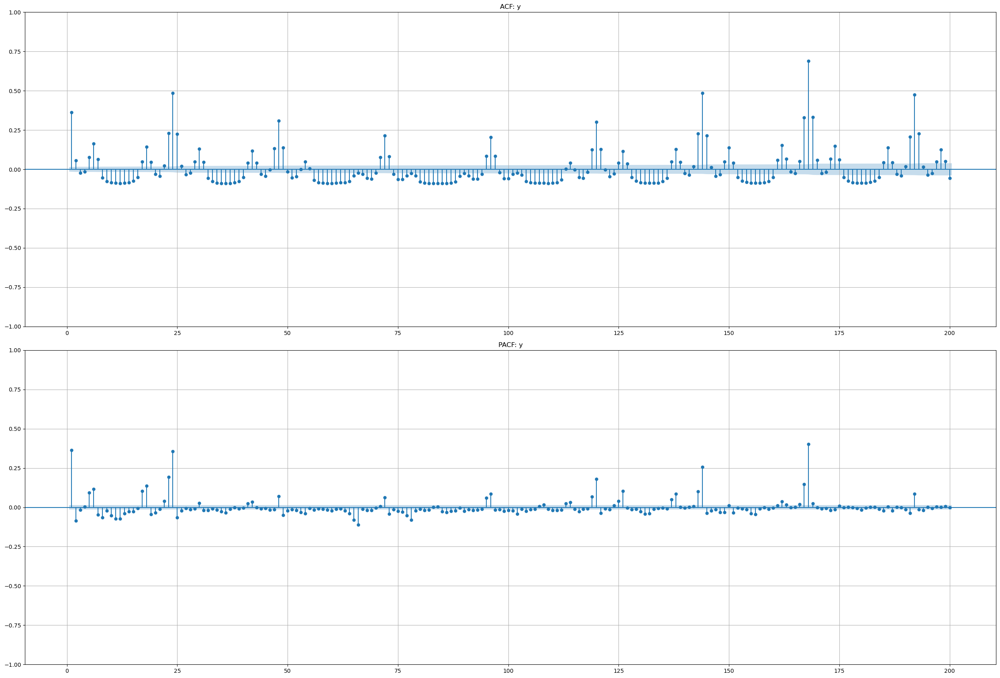
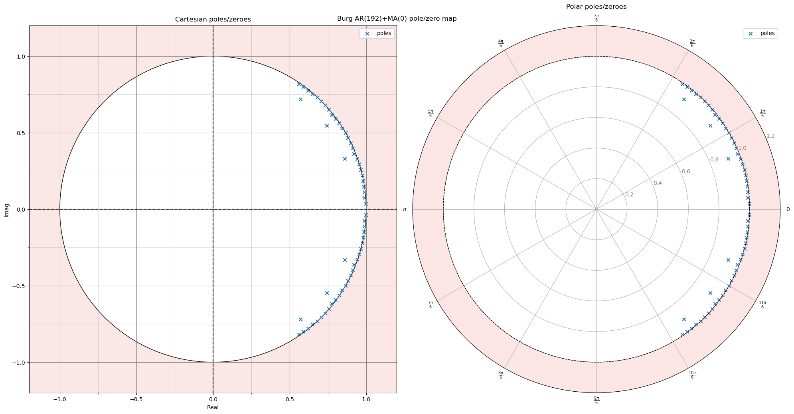
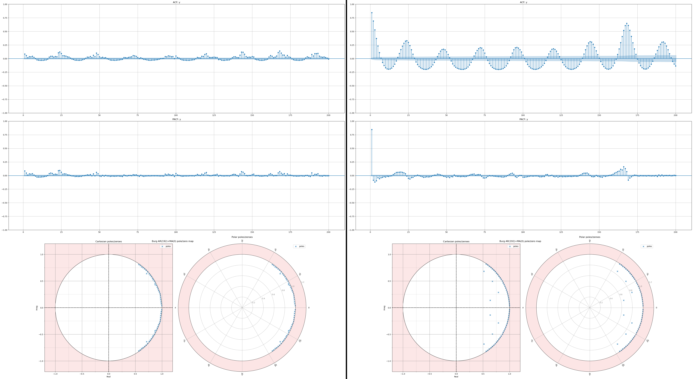
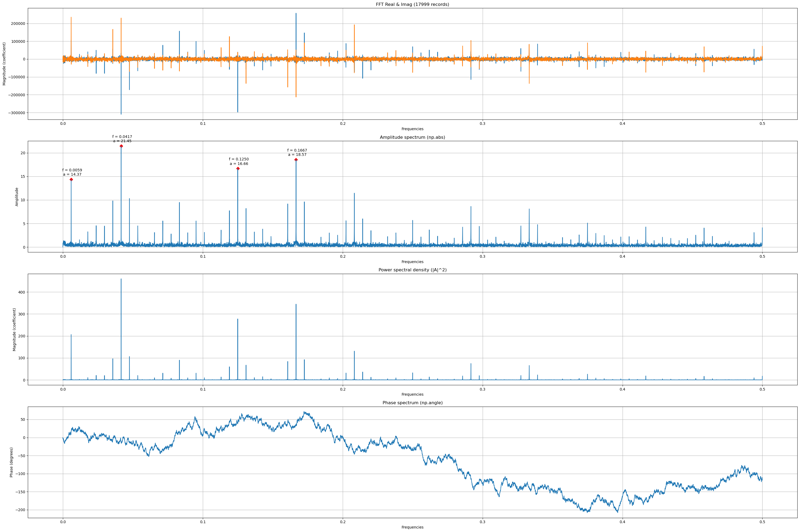
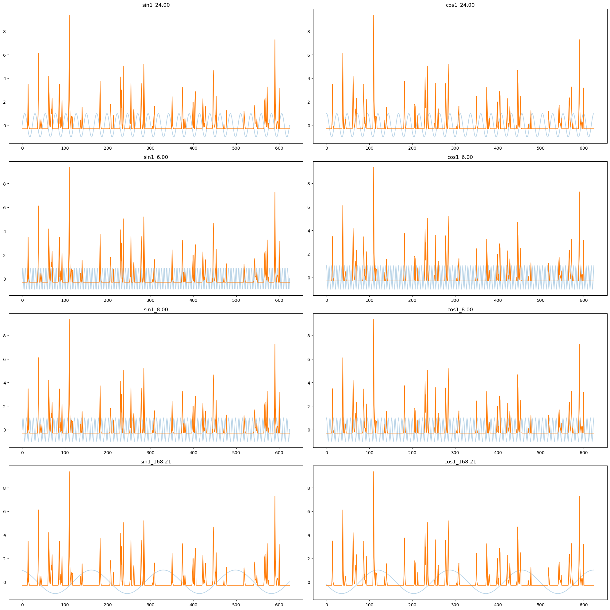
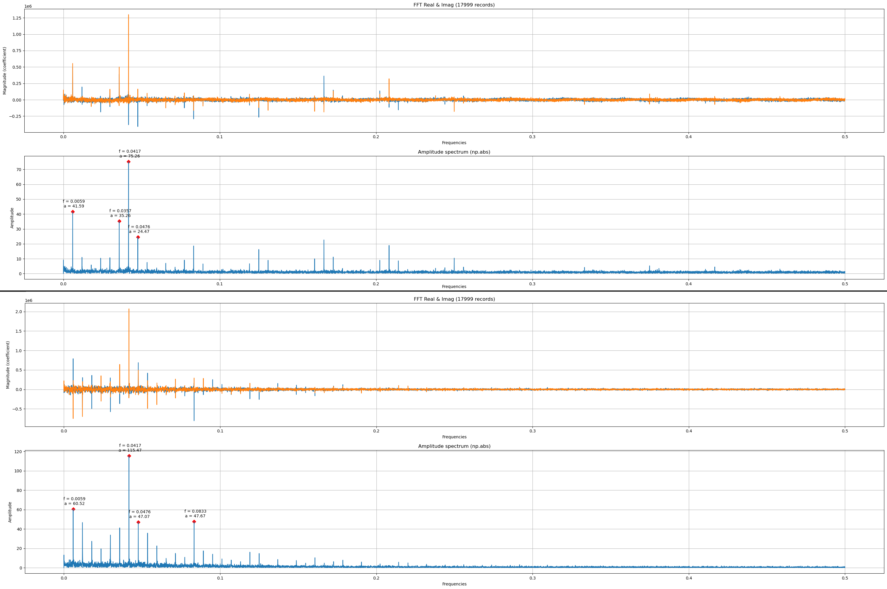
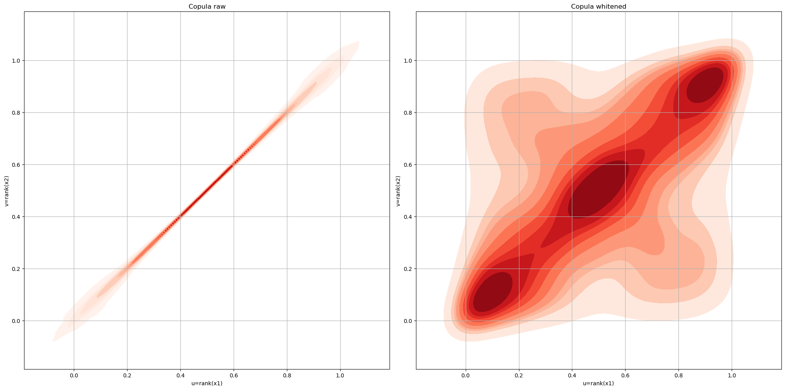
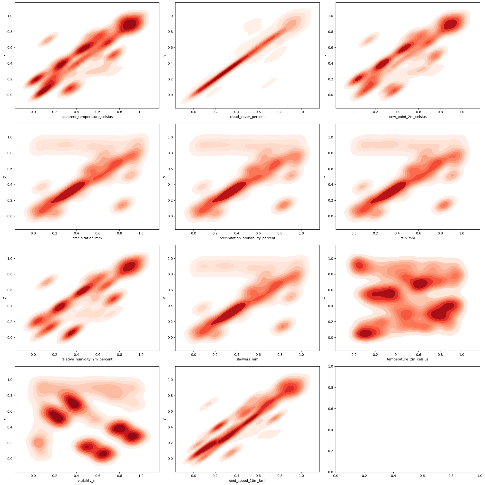

---
header-includes:
  - \usepackage{float}
  - \floatplacement{figure}{H}
  - \usepackage[export]{adjustbox}
  - \let\includegraphicsbak\includegraphics
  - |
    \renewcommand*{\includegraphics}[2][]{%
      \includegraphicsbak[frame,keepaspectratio,max width=\textwidth,#1]{#2}%
    }

geometry: margin=0.75in
papersize: a4paper
fontsize: 11pt
wrap: none
mainfont: "Liberation Serif"
sansfont: "Liberation Sans"
monofont: "Hack"
---

# Hospitality Sales: A Deep Dive - Part II

## Introduction
This series of articles is a semi-formal walkthrough exploring some of the very intricate and colourful dynamics of hospitality (hospo), especially food and beverage (F&B). All data sourced is proprietary.

In Part I we encountered a wild dataset of hospitality sales and weather regressors and applied some very elementary linear algebraic techniques (pivoted QR, Pearson correlation, the VIF) to reduce our covariates down to just a couple of orthogonal columns, `["relative_humidity_2m_percent", np.log1p("precipitation_mm")]`, against our hospitality sales time series, `y`. We also came across the invaluable insights that copulae give us in terms of joint dynamics between time series, and found out a few interesting relationships between the VIF and condition numbers, and copulae and their functionals. In Part II here, we'll shift our focus from the external to the internal and seek within, exploring the univariate temporal dynamics of sales itself.

### Broad Strokes
Briefly, in this part we're going to cover:
1. Autocorrelation.
2. Pole/Zero analysis.
3. Stationarity, and KPSS examples.
4. Introducing a theoretical model for sales.
5. Seasonality.
6. Whitened Copulae.

To recap, this was our original dataset complete with the original set of weather regressors:


Just as before, examples to the contrary of any conclusions we draw here will be provided as and when required for orientation. From the plot of `y` alone one should immediately suspect a lot of periodic behaviour, which also clues us into what we spoke about in Part I regarding "whitened copulae".

## Autocorrelation
A natural place to begin with uncovering the dynamics of a time series is the autocorrelation function (ACF, and partial autocorrelation, PACF) of the series, or - in other words - the Pearson correlation of the series with lagged versions of itself. [Wikipedia](https://en.wikipedia.org/wiki/Autocorrelation) has a great explanation on this topic, but to paraphrase - and highlight something really beautiful - the `acf` function from `statsmodels` is equivalent to the following:

```python
(
    df
    .loc[:, ['y']]
    .merge(
        right=df['y'].shift(list(range(1, 201))).dropna(),  # lags from 1..200+1
        left_index=True,
        right_index=True,
        how="inner"
    )
    .corr()      # pearson correlation, or X'X
    .iloc[:, 0]  # we only need the first column to collect all lag coefficients
    .plot.bar()  # the same barplot we see when we call `statsmodels.plot_acf()`
)
```

We simply slap lagged versions of our target time series onto the dataframe/matrix (taking it from a univariate vector to a matrix) up to `maxlags` (i.e., adding one column for each lag) and then compute the correlation coefficient $X^TX$ (Gram matrix) over that dataset.

The `pacf` is something slightly different, and is one such area where the relationship between the Pearson correlation and OLS comes into the spotlight! We know that the Pearson correlation is equivalent to z-standardised OLS. The ACF can be arrived at by a simple $X^TX$, but for the PACF, we need _an explicit OLS_, i.e., not just $X^TX$ but the full $(X^TX)^{-1}Xy$ because we need to partial out the intervening effects of the intermediate lags - which is equivalent to inverting the correlation matrix_ $X^TX$ in order to get just those portions of $X$ that don't overlap - and then project them onto `y`. There are a couple of things going on here:
1. Inverting the correlation matrix $(X^TX)^{-1}$ effectively inverts our correlation coefficients such that highly collinear columns get a very tiny coefficient and dissimilar ones get a large coefficient. The contribution of similar columns shrink whilst that of dissimilar ones increase. Multiplying this matrix with $X^Ty$ - which, when viewed as a simple matvec dot product, gives us the similarity between `y` and every column in $X$ - projects $X^Ty$ onto those columns that are the most dissimilar. Yes, we're talking pure linalg operations here.
2. We can say that $X^TX$ "projects" onto `y` because the Gram matrix meets a few criteria that ensure a matrix can be called a ["projection matrix"](https://en.wikipedia.org/wiki/Projection_matrix#Properties). For one thing (out of many), any matrix $P$ that's supposed to be a projection matrix **must** be idempotent: $P^2 = P; \; P(P(x)) = (P \circ P)(x) = I(x)$ since once something is projected onto something else (say, a vector onto another vector), projecting again shouldn't change the result.

In other words, to get $\text{PACF}(k)$, we must run the full $k$-lag OLS:

1. From the design matrix...
   $$
     X_t \;=\;\bigl[y_{t-1},\,y_{t-2},\,\dots,\,y_{t-k}\bigr]
     \quad\text{(for each }t\text{)}.
   $$

2. ...solve the normal OLS equation...
   $$
     \hat{\boldsymbol\phi}_k
     =\bigl(X^TX\bigr)^{-1}X^Ty,
   $$

3. ...and then read off the last coefficient
   $$
     \text{PACF}(k)=\hat\phi_{k,k},
   $$

   i.e. the entry of $\hat{\boldsymbol\phi}_k$ corresponding to $y_{t-k}$.

That last OLS coefficient is exactly the partial autocorrelation at lag $k$. As a computational shortcut, one often uses the Levinson-Durbin recursion on the autocovariance sequence:
$$
  \phi_{n,n} = \frac
      {\rho(n) - \sum \limits_{k=1}^{n-1} \phi_{n-1,k} \rho(n-k)}
      {      1 - \sum \limits_{k=1}^{n-1} \phi_{n-1,k} \rho(  k)}
$$

Where $\phi_{n,k} = \phi_{n-1,k} - \phi_{n,n} \; \phi_{n-1,n-k}$ for $1 \leq k \leq n-1$, and $\rho(n)$ is the autocorrelation function. This yields the same $\hat\phi_{k,k}$ as the OLS form above _without_ inverting large matrices. But wait a minute - if we slap lagged versions of our time series onto itself and make it a matrix, doesn't this affect our condition number? I mean, a lagged version of a time series that isn't a perfect sinusoid comes with noise (Fourier harmonics are orthogonal and form a basis, but noise can invalidate this), so there must be some correlation lurking somewhere. As it turns out, this is actually a well known thing! Whenever we stack lagged copies of a single series onto a design matrix:

$$
  X = \bigl[y_{t-1},\,y_{t-2},\,\dots,\,y_{t-k}\bigr],
$$

We're creating columns that - especially for nearby lags - are highly correlated. Recall from Part I that the condition number of $X^TX$ is:
$$
  \kappa(X'X)
  = \frac{\lambda_{\max}(X'X)}{\lambda_{\min}(X'X)},
$$

Where $\lambda_{\max}$ and $\lambda_{\min}$ are its largest and smallest eigenvalues.  Because lags $y_{t-i}$ and $y_{t-j}$ tend to be strongly correlated when $|i-j|$ is small, the eigenvalues of $X^TX$ will spread out and $\kappa(X^TX)$ will grow quickly as we increase $k$. A large condition number means our OLS solution is numerically unstable; for our PACF, the sampling variance of the last coefficient PACF$(k)$ will be inflated if $X$ is nearly collinear; we'll see wild swings in PACF estimates at high lags, especially if the ACF decays slowly as if it were an AR(1) or AR(2). This is a known concern. However, two things help:
1. Levinson-Durbin (Yule-Walker) recursion builds PACF estimates via a stable recursion using only the scalar autocovariances, avoiding direct inversion of huge, ill-conditioned matrices.
2. We truncate the PACF in practice - we typically only trust PACF estimates up to the point where the confidence bands ($\approx \pm \frac{1.96}{\sqrt{N}}$) remain narrow; beyond that, lags are usually statistically indistinguishable from zero.

So yes, stacking many lags *does* inflate the condition number of $X^TX$ and can make PACF estimates noisy. But specialised algorithms and confidence bounds ensure we remain on terra firma. With all of this said, let's look at our correlograms:



And isn't this just rich? There is an _immense_ amount of interacting seasonality in here - and that spike at lag 1 ($\rho \approx 0.40$) implies that this time series also has some short-term persistence to it (sales _now_ is approximately 40% correlated with sales 1 hour ago) which we can verify with a pair of formal ADF/KPSS tests. The spikes at lags 24 and 168 imply daily (24h) and weekly (168h) seasonality, and the intermediate spikes all happen at multiples of these, strongly hinting at there being an underlying harmonic ladder at play. There's quite a bit to dissect here, but at this point we can probably start to theorise a univariate model form:
$$
  y_t =
      \mu
    + \phi y_{t-1}
    + \alpha \sin \bigl( \frac{2\pi t}{24 } \bigr)
    + \beta  \cos \bigl( \frac{2\pi t}{24 } \bigr)
    + \theta \sin \bigl( \frac{2\pi t}{168} \bigr)
    + \gamma \cos \bigl( \frac{2\pi t}{168} \bigr)
    + \varepsilon_t
$$

Where $\phi \approx 0.40$, and the 24/168h Fourier bases assume our fundamental frequencies are the 24h and 168h periods. We can get an alternative perspective with a pole/zero plot to determine whether or not we have stochastic seasonality.

## Pole/Zero
Autocorrelation gets cooler. :)



_Disclaimer: we did run a Burg AR up to an order of 192 to capture the weekly period (168h), but we filtered out the remaining poles to just keep the first 20 harmonics of the 168h period ±some tolerance in angle. This was because including all 192 poles in here makes the plot incredibly difficult to read, and we already know our periods of interest from the ACF._

Gaze in and look at those beautiful poles! Each tiny blue `x` on in that image on the unit circle is a specific frequency/period. Since each pole sits at $z = r\,e^{i\theta}$ (where $\theta$ (in radians per time-step) is angular frequency), we can compute our periods by simply doing
$$
  T = \frac{2\pi}{\theta}\,,
$$

For example, an angle of $0.0373 \implies \frac{2\pi}{0.0373} \approx 168.45$, or a period of 168 hours (7 days). See how a few of our poles appear to snap exactly to the unit circle, i.e. $|z|=1$ (radius=1), whilst others tend to oscillate back and forth around the edge? The closer a pole is to an exact radius of 1, the more persistence that specific period carries with it, i.e. the closer to a unit root it has, the more stochastic it is. The further away from radius 1 we get, the more deterministic that period is. To clarify what we mean by deterministic and stochastic seasonality:
- **Deterministic seasonality** is where pole radii<1. It's deterministic because every cycle will repeat exactly the same way no matter what shock hits the series, since the damping causes shocks to die out. These poles generate oscillations that die out if perturbed, so the cycle never walks away.
- **Stochastic seasonality** is where pole radii=1 (seasonal unit root). It's stochastic because any random shock that hits that frequency persists forever, there is no damping to induce decay. The seasonal cycle is not a fixed sine-wave but rather a random walk that meanders around its mean each period.

Here, none of our poles are _exactly_ stochastic though they do carry a _lot_ of persistence with them - the same persistence we see in our P/ACF spike at lag 1. It's worth noting that P/ACF coefficients at a specific lag aren't owned by any single pole, but are in fact the net effect of all AR poles at that lag. Algebraically, if the AR polynomial is:
$$
  A(z) = 1 + \sum_{k=1}^{p} a_{k} z^{-k}
$$

Where $k$ is the lag, then at lag $k=1$ the first PACF spike is given by:
$$
  \phi_{11} = -a_{1} = \sum_{i=1}^{p} r_{i} \cos \bigl( \theta_{i} \bigr)
$$

Where each pole is $r_{i}e^{\pm i\theta_{i}}$. Geometrically, each pole at angle $\pm\theta_i$ contributes $r_i^k\cos(k \theta_i)$ to the net AR coefficient $a_k$. Poles closest to the positive real axis (small $\theta_i$) and nearest the unit circle ($r_i \lesssim 1$) will give the largest contributions even at higher lags (higher $k$), so the PACF decays slowly when there's a tight cluster of poles near $|z|=1, \theta=0$. So if $\phi_{11}$ - the first PACF spike - is large in magnitude, there must be substantial pole mass just inside the unit circle at a small angle. For example, the first 10 harmonics of the raw weekly poles look like this (note the complex conjugates):

| harmonic | poles                | p_radius   | p_angles    | p_periods    |
| :------: | -------------------: | ---------: | ----------: | -----------: |
| 1        | `0.998465+0.037341j` | `0.999163` | ` 0.037381` | `168.086533` |
| 1        | `0.998465-0.037341j` | `0.999163` | `-0.037381` | `168.086533` |
| 2        | `0.988582+0.074898j` | `0.991415` | ` 0.075619` | ` 83.089995` |
| 2        | `0.988582-0.074898j` | `0.991415` | `-0.075619` | ` 83.089995` |
| 3        | `0.988537+0.111896j` | `0.994849` | ` 0.112714` | ` 55.744384` |
| 3        | `0.988537-0.111896j` | `0.994849` | `-0.112714` | ` 55.744384` |
| 4        | `0.985902-0.148266j` | `0.996988` | `-0.149268` | ` 42.093456` |
| 4        | `0.985902+0.148266j` | `0.996988` | ` 0.149268` | ` 42.093456` |
| 5        | `0.979712-0.185530j` | `0.997124` | `-0.187156` | ` 33.571919` |
| 5        | `0.979712+0.185530j` | `0.997124` | ` 0.187156` | ` 33.571919` |
| 6        | `0.973864-0.222493j` | `0.998957` | `-0.224609` | ` 27.973903` |
| 6        | `0.973864+0.222493j` | `0.998957` | ` 0.224609` | ` 27.973903` |
| 7        | `0.965665-0.258710j` | `0.999720` | `-0.261762` | ` 24.003442` |
| 7        | `0.965665+0.258710j` | `0.999720` | ` 0.261762` | ` 24.003442` |
| 8        | `0.954442+0.294192j` | `0.998753` | ` 0.298994` | ` 21.014434` |
| 8        | `0.954442-0.294192j` | `0.998753` | `-0.298994` | ` 21.014434` |
| 9        | `0.939780+0.329395j` | `0.995835` | ` 0.337122` | ` 18.637714` |
| 9        | `0.939780-0.329395j` | `0.995835` | `-0.337122` | ` 18.637714` |
| 10       | `0.860535-0.329996j` | `0.921639` | `-0.366182` | ` 17.158628` |
| 10       | `0.860535+0.329996j` | `0.921639` | ` 0.366182` | ` 17.158628` |

For the first harmonic $k=1$, the pole radius is $\frac{1}{r_i} \cdot \cos(\theta_i) \approx 2.0002$, for $k=2, \; \frac{1}{r_i} \cdot \cos(\theta_i) \approx 4.2395$; we already have a contribution of around 6.2397. The sum of all our poles - without filtering down to just weekly harmonics - gives us:
```python
>>> pz = compute_poles_zeroes(df['y'], p=192, q=0)  #nofilter #raw
>>> pz = pz.dropna(axis=1).iloc[1:, :]              # q=0 => MA cols are NaN
>>> np.poly(1.0/pz["poles"])[1]                     # `poles` is already r*e^iθ
0.44179210161556437
```

Which is exactly the coefficient of our first PACF lag. So from all this, we've gathered that our seasonalities seem to not be exactly stochastic (they're mostly determinstic), but they do carry some degree of persistence. Crucially, we still do not know what our fundamental driving seasonalities/frequencies are, nor do we know how all of our seasonalities interact with one another as of yet. These are very important to know, because if we go ahead and layer our model with a bunch of Fourier bases (say, 168h, 24h, 8h and 6h periods), we are pretty much guaranteed to blow up in condition number.

Before we proceed, it pays to note that a hospitality ACF isn't always this feature rich (and sometimes, it's richer than what we have here). For example, consider these following ACF and corresponding pole plots:



As mentioned in Part I, each of Quantaco's venues come with their own signature time series. The one on the left here is completely featureless save for some very mild and lowly seasonal spikes. This kind of series is probably best modelled with just 2-4 harmonics of whatever fundamental frequencies exist in there. On the right however, we see the other extreme: a time series with incredibly strong persistence (AR(1)) plus sharply defined - almost stochastic - seasonalities. Only a handful of frequencies in the harmonic ladder decay over time. This kind of series necessitates seasonal detrending before projecting, say, 6-10 harmonics of its fundamental frequency.

Let's step away from our abstract mathematics for a second and talk about what we're actually seeing here. We're looking at hospitality sales over time, and the autocorrelation of the sales signal. For a time series to have barely any features yet still be a complete time series (i.e. no missing values, sales on every day) versus another time series that's very rich in seasonal dynamics seems to imply a measure of popularity between the two venues. Another way to read that statement is _"the venue on the left is subject to just some background noise of performance and a very basic level hospitality seasonal behaviour; the venue on the right is so popular that not only is there persistence, but there's also a very rigid self-reinforcing demand rhythm (whether through word-of-mouth, scheduled events, or brand loyalty)."_

## Stationarity
While we already have a good visual hunch that our sales data is stationary, that PACF lag 1 coefficient could cause us some trouble if there's a very slow-moving trend hiding in our data. We're going to be using both the [Augmented Dickey-Fuller](https://en.wikipedia.org/wiki/Augmented_Dickey%E2%80%93Fuller_test) and the [Kwiatkowski-Phillips-Schmidt-Shin](https://en.wikipedia.org/wiki/KPSS_test) tests here. For reference, from [statsmodels](https://www.statsmodels.org/dev/examples/notebooks/generated/stationarity_detrending_adf_kpss.html):
- Case 1: Both tests conclude that the series is not stationary - The series is not stationary
- Case 2: Both tests conclude that the series is stationary - The series is stationary
- Case 3: KPSS indicates stationarity and ADF indicates non-stationarity - The series is trend stationary. Trend needs to be removed to make series strict stationary. The detrended series is checked for stationarity.
- Case 4: KPSS indicates non-stationarity and ADF indicates stationarity - The series is difference stationary. Differencing is to be used to make series stationary. The differenced series is checked for stationarity.

The ADF is rather straightforward, but let's dig into the KPSS test and see how it works. At heart, the KPSS test statistic helps identify whether or not there's a _trend or mean_ at play in our data, and if we remove this, whether or not our data become stationary. Literally, a trend _or_ mean - one of the two. The test is essentially checking to see whether the variance of our data after demeaning/detrending versus before is the same ("same" in the sense of "within some tolerance", where the tolerance itself are the p-value levels). Given a series $y_{1},\dots,y_{T}$, we:
1. Specify whether we're testing stationarity around a constant ("level-stationary", `regression='c'`) or around a deterministic trend ("trend-stationary", `regression='ct'`).
2. Estimate the null regression:
   * For level: $y_{t}=\mu +\varepsilon_{t}$. Under this null, $y_t$ fluctuates around a fixed mean $\mu$ (a "long-run average") with no systematic drift.
   * For trend: $y_{t}=\alpha +\beta\,t +\varepsilon_{t}$. Under this null, $y_t$ follows a deterministic linear trend $\alpha + \beta t$, plus stationary noise.
3. Compute the residuals $\hat\varepsilon_{t}$ and their cumulative sums
   $$ S_{t}=\sum_{i=1}^{t}\hat\varepsilon_{i},\quad t=1,\dots,T $$
4. Estimate the "long-run variance" of $\hat\varepsilon_{t}$. In our toy examples (no serial correlation), we'll simply take
   $$ \widehat\sigma^{2} = \frac{1}{T}\sum_{t=1}^{T}\hat\varepsilon_{t}^{2} $$
5. Form the KPSS statistic
   $$ \eta \;=\;\frac{1}{T^{2}\,\widehat\sigma^{2}}\sum_{t=1}^{T}S_{t}^{2} $$
6. Compare $\eta$ to critical values (e.g. 0.347 at the 10% level, 0.463 at 5%). If $\eta$ is greater, reject the null of stationarity.

The reason we look at the _cumulative sum_ of residuals is because if $\hat{\varepsilon_t}$ truly bounce around a constant (or detrended) level, then their _partial_ sums will meander like a stationary process, so $S_t$ stays relatively small compared to $t$. But if there's actually a unit root (random walk behaviour), those residuals don't revert, and $S_t$ blows up growing on the order of $t$. In fact, the KPSS can be thought of as a signal to noise ratio:
- The numerator is the total "energy" in cumulative deviations, $\sum S_T^2$.
- The denominator scales by $T^2$ (so a truly stationary residual - whose partial sums grow like $\sqrt{t}$ - will make $\eta$ small) and by $\hat{\sigma^2}$, the long-run variance of residuals themselves.

Something to keep in mind is that the long-run variance is more than just the sample variance; in practice, one uses a Newey-West (or similar) estimator that accounts for autocorrelation in $\hat{\varepsilon_t}$. In our examples here, we ignore that and simply use $\hat{\sigma^{2}} = \frac{1}{T} \sum_{t=1}^{T} \hat{\epsilon_{t}^{2}}$; for real data, the choice of bandwidth/truncation matters. For a few worked examples, let's consider daily temperature (level-stationary), stock prices (a random walk), and some abstract trend-stationary series and see how the KPSS works for each of these.

### Example 1: Daily Temperature (Level-Stationary)

Suppose five days' high temperatures (°C):

| Day   | 1   | 2   | 3   | 4   | 5   |
| :---: | :-: | :-: | :-: | :-: | :-: |
| $y_t$ | 20  | 22  | 19  | 21  | 18  |

1. **Mean**:
   $$
     \mu=\tfrac{20+22+19+21+18}{5}=20
   $$
2. **Residuals** $\hat\varepsilon_{t}=y_{t}-20$:
   $$
     [0,\;2,\;-1,\;1,\;-2]
   $$
3. **Cumulative sums** $S_t$:
   $$
     [0,\;2,\;1,\;2,\;0]
   $$
4. **Long-run variance**
   $$
     \widehat\sigma^2=\frac{0^2+2^2+(-1)^2+1^2+(-2)^2}{5}=2
   $$
5. **KPSS**
   $$
     \sum_{t=1}^5 S_t^2 =0+4+1+4+0=9,
     \quad
     \eta=\frac{9}{5^2\cdot2}=\frac{9}{50}=0.18
   $$

Since $0.18<0.463$ (5% critical), we fail to reject stationarity; in sane English, we accept that our time series is stationary.

### Example 2: Stock Prices (Random Walk)

Five days of a hypothetical stock price:

| Day   | 1   | 2   | 3   | 4   | 5   |
| ----- | --- | --- | --- | --- | --- |
| $y_t$ | 100 | 101 | 103 | 102 | 105 |

1. **Mean**:
   $$
     \mu=102.2
   $$
2. **Residuals** $\hat\varepsilon_{t}=y_t-102.2$:
   $$
     [-2.2,\,-1.2,\,+0.8,\,-0.2,\,+2.8]
   $$
3. **Cumulative sums** $S_t$:
   $$
     [-2.2,\,-3.4,\,-2.6,\,-2.8,\;0]
   $$
4. **Long-run variance**
   $$
     \widehat\sigma^2=\tfrac{(-2.2)^2+(-1.2)^2+0.8^2+(-0.2)^2+2.8^2}{5}\approx2.96
   $$
5. **KPSS**
   $$
     \sum S_t^2\approx4.84+11.56+6.76+7.84+0=31.0,
     \quad
     \eta=\frac{31.0}{25\cdot2.96}\approx0.419
   $$

Here $0.419>0.347$ (10% critical), so we reject stationarity (or _fAiL tO aCcEpT_) and have a unit-root series.

### Example 3: Trend-Stationary Series

Consider a series with a clear upward trend plus small noise:

| $t$   | 1   | 2   | 3   | 4   | 5    |
| :---: | :-: | :-: | :-: | :-: | :--: |
| $y_t$ | 2.5 | 4.1 | 6.1 | 7.8 | 10.2 |

#### (a) Ignoring the Trend (regression='c')

1. **Demean** around $\mu \approx 6.14$. The residuals are:
   $$
     [-3.64,-2.04,-0.04,1.66,4.06].
   $$
2. **Cumulative sums** $S_t$:
   $$
     [-3.64,-5.68,-5.72,-4.06,0].
   $$
3. **Long-run var** $\approx 7.33$.
4. $\sum S_t^2\approx94.7$, so
   $\eta \approx \frac{94.7}{(25\cdot7.33)} \approx 0.52$<br>

In this case we reject stationarity (though we've incorrectly treated a trend as a unit root).

#### (b) Removing the Trend (regression="ct")

1. **Fit**
   $$
     y_t = a+b t, \;\; a \approx 0.2,\; b \approx 2.0
   $$
2. **Residuals** $y_t-(0.2+2t)$:
   $$
     [+0.3,-0.1,-0.1,-0.4,0.0]
   $$
3. **Cum-sums** $S_t$:
   $$
     [0.3,0.2,0.1,-0.3,-0.3]
   $$
4. **Long-run var** $\approx 0.054$.
5. $\sum S_t^2=0.32$, so
   $\eta= \frac{0.32}{(25\cdot0.054)} \approx 0.24$<br>

$0.24<0.463$: Accept (fail to reject) that the series is trend-stationary.

Clearly, the most important bit for the KPSS then is choosing the correct null regression so that we don't misclassify a determinstic trend as a unit root. That's really all there is to it. We're effectively checking whether the system pulls back (stationary) or wanders off (unit root), as measured by how big those cumulative deviations get relative to our data's noise level. For our dataset, both choices give us the same result:

| column | adf | adf_is_stationary | kpss | kpss_is_stationary | trend | conclusion |
| -----: | :-: | :---------------: | :--: | :----------------: | ----: | ---------: |
| y      | 0   | True              | 0.1  | True               | c     | stationary |
| y      | 0   | True              | 0.1  | True               | ct    | stationary |

Implying our time series as a whole is stationary. So what of that $\approx 0.44$ lag 1 PACF coefficient? Well, our time series has no global unit root (via the tests we just ran), and our seasonalities have mild persistence (close to, but not exactly, pole radius=1). This mild, short-term persistence is what the PACF picked up, and implies that our model might benefit from seasonal detrending (though this is mostly an empirical choice to make). For discussion sake, ADF regression choices `ctt, n` also yielded p-values of 0.

## Pause
At this point, we have a few options for our theoretical model (for all following examples, we're going to assume a weekly (168h) fundamental period):
1. Our seasonalities are exact, or nearly exact, sinusoids with noise. In this scenario, we just need a bunch of Fourier harmonics based off our mystery fundamental frequencies to regress against. We can reuse the same model spec from earlier, which in pseudocode would look something like:
  $$
    y_t =
        \mu
      + \phi y_{t-1}
      + \sum_k \left[
           \alpha_k \sin \left( \frac{2\pi k t}{168} \right)
         + \beta_k  \cos \left( \frac{2\pi k t}{168} \right)
         \right]
      + \varepsilon_t
  $$
   ```python
   # option 1
   def generate_fourier_terms(n: int, freqs: list[dict]) -> pd.DataFrame:
       """
       Generates sine/cosine Fourier harmonics.
       """
       t = np.arange(1, n+1)
       terms = {}

       for f in freqs:
           p = f["period"]
           K = f.get("harmonics", int(p/2))
           for k in range(1, K+1):
               terms[f"sin{k}_{p:.2f}"] = np.sin(2*np.pi * k * t/p)
               terms[f"cos{k}_{p:.2f}"] = np.cos(2*np.pi * k * t/p)

       return pd.DataFrame(terms)


   X = generate_fourier_terms({"harmonics": 10, "period": 168})
   alpha, *_ = np.linalg.lstsq(X, y)
   resid = y - alpha.dot(X)
   ```

2. We have persistence in our seasonalities, meaning they carry some of the shocks with them for the short-term even though they die out over time. In this case, some kind of seasonal moving average would be the best regressor instead of Fourier terms, since the MA would directly involve not just the fundamental periods but also some of the short-term shocks. In pseudocode, our model changees into:

   \begin{align*}
     y_t &= s_t + \varepsilon_t \\
     s_t &= \mu \bigl[ y \mid \text{hour-of-week}(t) \bigr]
   \end{align*}

   ```python
   # option 2
   ma = df['y'].groupby([df.index.weekday, df.index.hour]).agg("mean")
   alpha, *_ = np.linalg.lstsq(ma, y)
   resid = y - alpha.dot(ma)
   ```

3. Our time series is a mix of both exact sinusoids and short-term seasonal shocks. In this case, we can let the Fourier bases address the precise periodicity whilst the MA addresses persistence. In pseudocode, our model would change into:
   $$
     y_t =
         \mu
       + \phi y_{t-1}
       + \sum_k \left[
           \alpha_k \sin \left( \frac{2\pi k t}{168} \right)
         + \beta_k  \cos \left( \frac{2\pi k t}{168} \right)
         \right]
       + \gamma s_t
       + \varepsilon_t
   $$
   ```python
   # option 3
   X_ma = X.merge(ma, index=True, how="inner")
   alpha, *_ = np.linalg.lstsq(X_ma, y)
   resid = y - alpha.dot(X_ma)
   ```

   A variant of this option includes projecting our Fourier bases onto the MA, then using the residuals (which, by design, will be orthogonal to the frequential components in sales and thus only carry shocks) as a regressor, similar in concept to Gram-Schmidt orthonormalisation.

4. We have extreme seasonal persistence _plus_ very precise Fourier behaviour, akin to the 2nd contrarian P/ACF plot we saw in Figure 4. In this case, a simple projection of a seasonal moving average won't help much; we'd need a solid detrending step to remove persistence and then an explicit projection of Fourier terms. With pseudocode, this changes our model into:
   $$
     y_t - s_t = \mu
       + \phi y_{t-1}
       + \sum_k \left[
           \alpha_k \sin \left( \frac{2\pi k t}{168} \right)
         + \beta_k  \cos \left( \frac{2\pi k t}{168} \right)
         \right]
       + \varepsilon_t
   $$
   ```python
   # option 4
   y_detrended = y - ma
   alpha, *_ = np.linalg.lstsq(X, y_detrended)
   resid = y_detrended - alpha.dot(X)
   ## of course, we'd need to add back the MA for our forecasts to make sense
   ```

In this case, we don't actually have extreme persistence so option 4 is right out. Option 1 was what we started with, and as we've seen, we do have some short-term seasonal persistence, so pure Fourier approaches will miss capturing some information. Option 2 helps address our persistence but ignores our explicit seasonality, whilst option 3 combines the two. Let's see which of these two would work the best - to do this, we can inspect our time series' FFT spectrogram. If we see very, very well defined and sharp peaks sticking out all across the frequency spectrum with very little background noise, and the peaks seem to "echo" not just at harmonics of the daily/weekly frequencies but at other places as well, we know we have explicit seasonalities and that option 3 will work the best. If we instead just see a repetition of frequential patterns, we can surmise option 2 will work the best.

## Seasonality
Time for our FFT!



This is where it gets really interesting: we have very well defined sharp peaks across our frequency spectrum and a low level of background noise. The PSD particularly highlights the persistence of our frequencies, and the highlighted frequencies are the 4 highest amplitude ones, in order of appearance: $f_i = [0.0417, 0.1667, 0.01259, 0.0059]$. These frequencies correspond directly to the 24, 6, 78 and 168 hour perods (where period = 1/f); and if we look closely, we'll see that while we do have spikes at harmonics of these frequencies, not all the spikes are at those harmonics. We do have explicit seasonalities to model, making our best option for this time series option 3. In fact, we can actually take these frequencies and plot them out against our sales data to see how they line up:



And they actually do line up pretty well! However for discussion sake, it's well worth it to also look at time series that benefit from modelling options 2 and 4. Here are a couple of examples, with the 2nd FFT being the same one from the right-side ACF in Figure 4:



Fun fact: another good way to get a read on how our seasonality appears over time in our raw data is grouping our time series by "season" (monthly, daily, weekly, etc.) and boxplotting our sales values, giving us a boxplot over time. We can track median shifts, IQR and variance over time, and we'd actually get a fairly robust read into what our seasonalities look like at a ground level. We have what we need from our FFT however, so we're going to just kinda sorta move on.

## Whitened Copulae
We now have sufficient information from here to now go back and understand what's going on with our whitened empirical ranked copulae. In Part I, we mentioned in passing that [copulae are extremely sensitive to certain univariate dynamics](https://en.wikipedia.org/wiki/Copula_(statistics)#Stationarity_condition) like autocorrelation, trends and seasonality. The copula between two semi-correlated sine waves with noise will be very, very different from the copula between those two waves after the seasonality (sinusoidal behaviour) has been removed; the latter depicts the pure codependence and mixing betwixt the two without univariate influence. For example, consider these copulae generated by this code:

```python
def plot_copula(x1: np.ndarray, x2: np.ndarray, ax: Axes|None = None) -> Axes:
    """
    Plots the empirical rank-based copula between `x1` and `x2`; rank -> [0,1].
    """
    a1 = pd.Series(x1).rank(pct=True).rename("u=rank(x1)")
    a2 = pd.Series(x2).rank(pct=True).rename("v=rank(x2)")
    ax = seaborn.kdeplot(x=a1, y=a2, cmap="Reds", fill=True, thresh=0.05, ax=ax)
    ax.set_title("Copula")
    ax.grid()
    return ax


def generate_design(x: np.ndarray, lag: int) -> pd.DataFrame:
    """
    Generates a design matrix for `x` with 10 24h harmonics and 1-period lag.
    """
    lagged = pd.Series(x, name='x').shift(lag)
    F = generate_fourier_terms(n=N, freqs=[{"harmonics": 10, "period": 24}])
    X = pd.concat([lagged, F], axis=1).fillna(0.0)
    return X


def ols_whiten(X: np.ndarray, y: np.ndarray) -> np.ndarray:
    """
    OLS projects `X` onto `y` and returns the residuals.
    """
    alpha, *_ = np.linalg.lstsq(X, y)
    resid = y - (X@alpha)
    return resid


N = 10_000                  # data length
t = np.linspace(0, 500, N)  # data
phi = 0.4                   # AR coefficient
sigma = 0.1                 # noise stdev
alpha = 0.55                # correlation (1-alpha)

# source data - no jitter, pure seasonality
sin_1 = np.sin(2*np.pi*t/24)
sin_2 = np.sin(2*np.pi*t/24)

# white noise innovations with correlation
common = np.random.normal(0, sigma, size=N)
indep1 = np.random.normal(0, sigma, size=N)
indep2 = np.random.normal(0, sigma, size=N)

noise1 = alpha*indep1 + (1-alpha)*common
noise2 = alpha*indep2 + (1-alpha)*common

# AR(1):  e[t] = phi*e[t-1] + eps[t]  <=>  filter b=[1], a=[1, -phi]
e1 = lfilter(b=[1], a=[1, -phi], x=noise1)
e2 = lfilter(b=[1], a=[1, -phi], x=noise2)

# ------------------------ raw series: seasonality + AR ------------------------
# smooth amplitude modulation over time
y1 = (0.75 + 0.25*e1) * sin_1
y2 = (0.75 + 0.25*e2) * sin_2

# --------------------------------- whitening ----------------------------------
X1 = generate_design(y1, 1)
w1 = ols_whiten(X1, y1)

X2 = generate_design(y2, 1)
w2 = ols_whiten(X2, y2)
```



From our analysis here, we can see that our sales data has an AR(1) process plus seasonality, no trend, just like our exemplar `y1` in that code. As such, plotting a naive copula between sales and our weather data runs us into a well-known artefact: seasonality and AR bleed across time series (worse if the other series is also seasonal and AR _like weather often is_), and any serial structure in each marginal series would induce spurious dependence even if the true instantaneous relationship is zero. This is what we can see in Figure 8: the unwhitened copula on the left is immensely concentrated down the diagonal owing to serial correlation within `y1, y2`. The whitened copula on the right has these effects removed, uncovering the true footprint of the 55% correlation between `y1, y2`, and clearly shows how extreme the influence of such dynamics is. In fact, the astute reader would have noticed that we didn't touch upon [cross-correlation](https://en.wikipedia.org/wiki/Cross-correlation) between weather and sales in Part I, despite it being an extremely effective tool to use when whittling down temporal regressors. We didn't for this very same reason: if we cross-correlate two strongly autocorrelated (and in our case, seasonal) series, we'll inevitably see a sinusoidal CCF (cross-correlation function), even if there's no direct causal link at every one of those lags. Concretely, let's say we have these two time series $y_t$ and $x_t$, both containing damped-sinusoidal seasonality and AR(1) structure (like we generated in our code above):

\begin{align*}
  y_t &= \sum_{k=1}^K A_k \cos \bigl( \omega_k t + \phi_k \bigr)\, e^{-\lambda t} \;+\; \phi_y\, y_{t-1} \;+\; \varepsilon_t \\
  x_t &= \sum_{k=1}^K B_k \cos \bigl( \omega_k t + \psi_k \bigr)\, e^{-\mu t} \;+\; \phi_x\, x_{t-1} \;+\; \eta_t
\end{align*}

By definition, the cross-correlation function (CCF) is given by:
$$
  CCF_{XY}(h))
  = \hat\rho_{yx}(h)
  = \frac{\sum \limits_{t} (y_t - \bar{y})(x_{t+h} - \bar{x})}
         {\sqrt{\sum \limits_t(y_t-\bar y)^2\,\sum_t(x_{t+h}-\bar x)^2}}
$$

If $y_t$ and $x_t$ share periodic components at frequency $\omega$, then $\hat\rho_{yx}(h)\approx\cos(\omega h)$ regardless of any true contemporaneous coupling. The AR(1) bleeds these sines across lags, creating a sinusoidal envelope in the CCF. Even for our empirical rank-based copula, we have $u_t = \tfrac1N \mathrm{rank}\{y_t\}, \; v_t = \tfrac1N\mathrm{rank}\{x_t\}$. The empirical copula density $\hat{c}(u,v)$ is distorted by serial clustering: runs of high/low seasons create patches along the diagonal $u \approx v$. The culprit is the same in both cases. For reference, consider these unwhitened copulae versus the whitened copulae we saw in Part I:



**Whitening** attempts to remove this kind of serial structure in a time series to inspect genuine cross-dependence. All this being said, the way we obtained those whitened copulae in Part I was by OLS projecting a slightly modified Option 3 model (no moving average $\gamma \; s_t$, just a 24h lag and some harmonics of the daily frequency) - just like in our `ols_whiten` function above:
$$
  y_t =
      \mu
    + \phi_1 y_{t-1}
    + \phi_{24} (t-24)
    + \sum_k^{10} \left[
        \alpha_k \sin \left( \frac{2\pi k t}{24} \right)
      + \beta_k  \cos \left( \frac{2\pi k t}{24} \right)
      \right]
    + \varepsilon_t
$$

And plotting copulae on the residuals; likewise for our CCFs, which actually tell us nothing new over and above what we've seen from the Pearson correlation in Part I. To briefly elaborate on the CCF and why it doesn't help us much at this point, if our ACF is equivalent to $X^TX$ (as discussed earlier) which is the dot product between every column in $X$ and its lagged versions, the CCF is then simply $X^TY$, where $Y$ is a matrix of lagged versions of another regressor that isn't $X$ (i.e., $Y \ne X$). In Pandas code, this'd look like:

```python
N = 201  # number of lags +1
(
    df
    .loc[:, ['y']]
    .merge(
        right=df["rain_mm"].shift(list(range(-N, N))).dropna(),  # or any other regressor
        left_index=True,
        right_index=True,
        how="inner"
    )
    .corr()      # pearson correlation, or X'Y
    .iloc[:, 0]  # we only need the first column to collect all lag coefficients
    .plot.bar()
)
```

All of this is great and all, but we've yet to answer our core question: what are our driving frequencies? While we certainly have daily and weekly seasonality at play, why did so many frequencies pop out at us from the FFT, why do we have 4 different waveforms here that all line up with sales? Do we really need all of these harmonic regressors? Are some of the frequencies we see in the FFT an interaction between only a few frequencies; can we find out the "matrix rank" of our frequency spectrum to arrive at some full-span subset of orthgonal ones that drive our time series?

We tackle these questions in-depth in Part III.

# The End of Part II
We thus far have this preliminary model of sales alongside our two weather regressors from before:

$$
  y_t =
      \alpha
    + \phi y_{t-1}
    + \sum_{f \in F} \;\sum_{k=1}^{K_f} \left[
        \beta_{f,k}^{(1)} \sin\left( \frac{2\pi k t}{f} \right)
      + \beta_{f,k}^{(2)} \cos\left( \frac{2\pi k t}{f} \right)
      \right]
    + \gamma \; s_t
    + \sum_r \vec{\rho}_r^{\top} \text{Weather}_{t,r}
    + \varepsilon_t \;; \\
$$

\begin{align*}
  s_t &= \mu_h \left[ y \mid \text{hour-of-week}(t) \right] \\
  \text{Weather}_t &=
    \begin{bmatrix}
      \text{relative humidity}_t \\
      \log(\text{precipitation}_t) \\
    \end{bmatrix}
\end{align*}

Where $F = \lbrace f_1, f_2, \cdots, f_N \rbrace$ is the set of all our to-be-discovered fundamental frequencies, and $\text{Weather}_t$ is a **matrix** of weather regressors indexed at time $t$. All of this basically says that right now, our sales is given by some linear additive model equal to some long-term level $\alpha$ plus:
- Some measure of the previous value ($\phi y_{t-1}$).
- A Fourier basis with as many harmonics per frequency as we need.
- Some measure of its own seasonal moving average ($\gamma \, s_t$).
- Coefficients $\rho_r$ for each of our weather regressors from Part I, `relative_humidity_2m_percent` and `log(precipitation_mm)`.
- Some noise ($\varepsilon_t$).

More succinctly:

$$
  y_t =\;
      \alpha
    + \phi y_{t-1}
    + \sum_{f \in F} \sum_{k=1}^{K_f} \text{Fourier}_f(t)
    + \gamma \; s_t
    + \vec{\rho}^{\top} \text{Weather}_t
    + \varepsilon_t
$$

We also uncovered a very interesting connection between OLS, the Pearson correlation, and the ACF/PACF, adding further credence to something discussed a long time ago but hasn't left me since: [Common Statistical Tests are Linear Models](https://lindeloev.github.io/tests-as-linear/).
