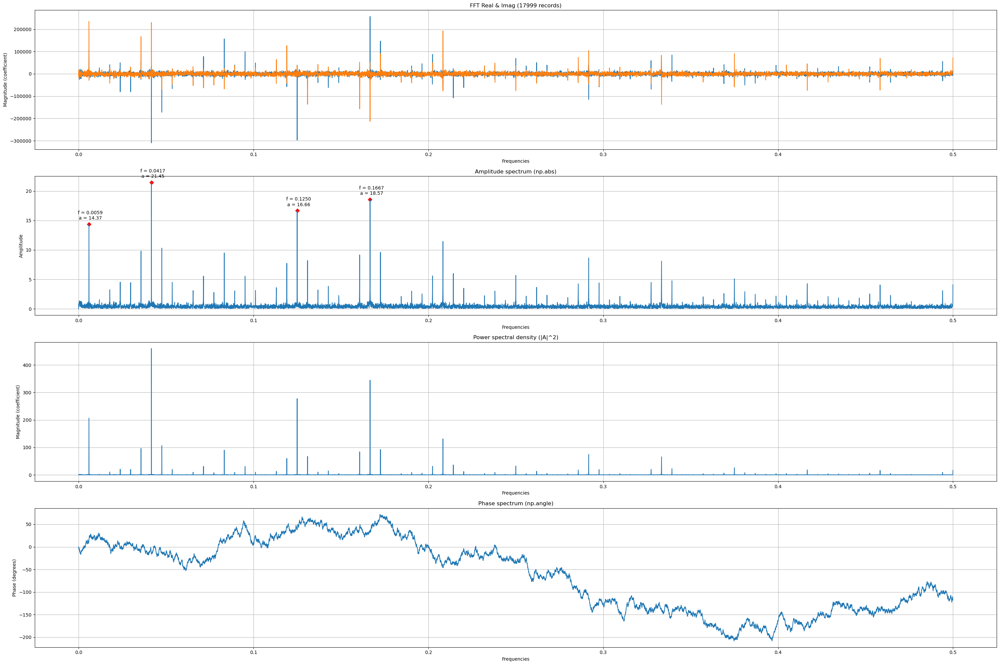

---
header-includes:
  - \usepackage{float}
  - \floatplacement{figure}{H}
  - \usepackage[export]{adjustbox}
  - \let\includegraphicsbak\includegraphics
  - |
    \renewcommand*{\includegraphics}[2][]{%
      \includegraphicsbak[frame,keepaspectratio,max width=\textwidth,#1]{#2}%
    }
  - \usepackage{needspace}

geometry: margin=0.75in
papersize: a4paper
fontsize: 11pt
wrap: none
mainfont: "Liberation Serif"
sansfont: "Liberation Sans"
monofont: "Hack"
---

# Hospitality Sales: A Deep Dive - Part III

## Introduction
This series of articles is a semi-formal walkthrough exploring some of the very intricate and colourful dynamics of hospitality (hospo), especially food and beverage (F&B). All data sourced is proprietary.

In Part I we dove into a dataset of hospitality sales (`y`) alongside a bunch of exogenous weather regressors, and through simple applications of elementary linear algebra and statistics, we filtered the covariates down to an orthogonal pair. In Part II, we sought within and explored the temporal dynamics of sales, uncovering a resolute abundance of rich periodicities that we tried to comprehend with more linearity (ACF, PACF) and a foray into the complex plane (pole/zero analysis, FFT). Across both parts, we also traversed some very beautiful bridges betwixt OLS, the Pearson correlation, VIF, condition numbers, and autocorrelation, and how copulae help see beyond local linearity. At the end of Part II, though we saw that our sales was a mix of Fourier bases and real world noise, we still had no idea what our driving frequencies were, and how many of them there are.

In Part III, we're going to flesh out the seasonal behaviour in our data by fully embracing the power of the complex plane $\mathbb{C}$ via some seemingly innocuous signal processing techniques.

### Broad Strokes
Briefly, in this part we're going to cover:
1. Stochastic vs. Deterministic Seasonality.
2. Bicoherence and Trilinear Maps.
3. Cepstrums.
4. Magnitude-Squared Coherence.
5. Partial Bicoherence.
6. Surrogate Grid Searches.

To recap, this was our original dataset complete with the original set of weather regressors:


And at the end of Part II, we had this theoretical model going:

$$
  y_t =
      \alpha
    + \phi y_{t-1}
    + \sum_{f \in F} \;\sum_{k=1}^{K_f} \left[
        \beta_{f,k}^{(1)} \sin\left( \frac{2\pi k t}{f} \right)
      + \beta_{f,k}^{(2)} \cos\left( \frac{2\pi k t}{f} \right)
      \right]
    + \gamma \; s_t
    + \sum_r \vec{\rho}_r^{\top} \text{Weather}_{t,r}
    + \varepsilon_t \;; \\
$$

\begin{align*}
  s_t &= \mu_h \left[ y \mid \text{hour-of-week}(t) \right] \\
  \text{Weather}_t &=
    \begin{bmatrix}
      \text{relative humidity}_t \\
      \log(\text{precipitation}_t) \\
    \end{bmatrix}
\end{align*}


But as mentioned, we're still far from sure about what periods $F$ actually drive our sales. The full FFT we saw at the close of Part II was:



Let's dig into what's going on here.

_(PS: This part is going to be rather dense. Everything from signal processing is going to throw at least thrice its weight in potency; the subject is just ridiculous.)_

### An Important Distinction
Before we begin, since we're melding signal processing (sigproc) with general time series analysis, we want to be _very clear_ on what we mean by "stochastic" versus "deterministic" seasonality. Practitioners in time-series (ARIMA) land often call anything with an exact unit-root "stochastic", whereas signal-processing folks further subdivide that into noisy versus noise-free cases (and for good reason). We'll bridge both worlds by understanding where they come from and tying it all back to our use-case.

The general data science definitions - and the ones we used in Part II - are:
- **Stochastic seasonality** implies an AR pole at radius = 1; shocks are persistent and accumulate over time, causing the seasonal period (pole angle) to drift. Amplitude waxes and wanes.
- **Deterministic seasonality** implies an AR pole with radius < 1; shocks decay causing the seasonal period (pole angle) to remain fixed. Amplitude is constant.
- References:
    - Box, G. E. P., Jenkins, G. M., & Reinsel, G. C. (2015). Time Series Analysis: Forecasting and Control (5th ed.). Wiley.
    - Shumway, R. H., & Stoffer, D. S. (2017). Time Series Analysis and Its Applications: With R Examples (4th ed.). Springer.
    - Hyndman, R. J., & Athanasopoulos, G. (2021). Forecasting: Principles and Practice (3rd ed.). OTexts.

In sigproc however, things are quite rigorous with 3 distinctions:
- **Stationary stochastic seasonality**, where pole radii are < 1 (so shocks decay geometrically) and a _noise term_ injects randomness at every step. We get a stochastic oscillation whose amplitude waxes and wanes, but remains mean-reverting.
- **Nonstationary stochastic seasonality**, where pole radii = 1 (seasonal unit root), and a _noise term_ that implies shocks never decay. The amplitude here will perform a random walk.
- **Pure deterministic seasonality**, where pole radii = 1 (seasonal unit root) _without a noise term_; it's a noise-free sinusoid. The oscillation is perfectly periodic without any random walk or stochastic amplitude component.
- References:
    - Marple, S. L. (1987). Digital Spectral Analysis with Applications. Prentice Hall.
    - Cohen, L. (1995). Time-Frequency Analysis. Prentice Hall.
    - Oppenheim, A. V., & Schafer, R. W. (2010). Discrete-Time Signal Processing (3rd ed.). Pearson.

In our case, we we only need to concern ourselves with two of these:

|                   Signals Processing |              Data Science | Implication |      Our Use-Case |
| ------------------------------------ | ------------------------- | ----------- | ----------------- |
| Stationary stochastic seasonality    | Deterministic seasonality |     $z < 1$ | **Non-unit root** |
| Nonstationary stochastic seasonality | Stochastic seasonality    |     $z = 1$ | **Unit root**     |

Basically, we dropped the sigproc classification "pure determinsitic seasonality" because it's a theoretical abstraction, and we're describging our findings based off unit roots because that's the unifying factor betwixt the two schools. Sigproc's "stationary" (mean-reverting) is equivalent to data science's deterministic, and likewise for nonstationary (drift) and stochastic.

Onwards!

## Bicoherence
The first thing we want to nail down is what our fundamental frequencies are. We know from earlier that we have a strong daily and weekly rhythm, but we also saw many other frequencies pop out at us from our FFT. We want to find out which frequencies in here drive the entire process, and watch their interaction with other frequencies. To help us out, we have the bicoherence. In a peanutshell, this helps us identify family trees of frequencies and helps us hone into their roots.

Now, make no mistake: there is an _overwhelming_ amount of rich theory behind the bicoherence and its constituent steps, the bispectrum, cumulants, moment-generating functions, general sigproc theory and the behaviour of signals/waves. We're going to take a less rigorous route here and elide much of that, instead approaching bicoherence from a relatively more intuitive standpoint: tringonometry and linear algebra. We start our journey from very elementary trig identities: the sums-to-products ([the burden of proof](https://en.wikipedia.org/wiki/Proofs_of_trigonometric_identities#Sum_to_product_identities) is left unto the reader :D ):

\begin{align*}
  \sin(\alpha) \cdot \sin(\beta) &= \frac{1}{2} \cos(\alpha - \beta) - \frac{1}{2} \cos(\alpha + \beta) \newline\\
  \cos(\alpha) \cdot \cos(\beta) &= \frac{1}{2} \cos(\alpha + \beta) + \frac{1}{2} \cos(\alpha - \beta) \newline\\
  \sin(\alpha) \cdot \cos(\beta) &= \frac{1}{2} \sin(\alpha + \beta) + \frac{1}{2} \sin(\alpha - \beta)
\end{align*}

From our perspective, these identities tell us that when any two waves interact, their product yields new waves at the sum and difference frequencies between the original two with exactly half the amplitude of the product. Recall: our point here is to find out the fundamental frequencies in our sales series, or in other words, what interactions do we have amongst our seasonalities that would help us identify the core _bases_ of waves in our sales. Now let's take a detour into linalg and talk about linear maps.

I'm fairly certain every single person who reads this is familiar with the dot product between two vectors. The dot product itself, $\vec{x} \cdot \vec{y}$, is a bilinear map. The basic operation of a bilinear map is:
$$ \sum \limits_i a_i b_i $$

And naturally, this can be extended into a _trilinear_ map very easily:
$$ \sum \limits_i a_i b_i c_i $$

And so on and so forth for 4-linear, 5-linear, up to N-linear maps. For our purposes here, we're only going up to trilinear for reasons explained shortly. Before proceeding, it's important to note this equivalence:

\begin{align*}
  \sum \limits_i a_i b_i c_i &= (\vec{a} \odot \vec{b}) \cdot \vec{c} \\
  &= \vec{a} \cdot (\vec{b} \odot \vec{c}) \\
  &= (\vec{a} \odot \vec{c}) \cdot \vec{b}
\end{align*}

Which says that the raw trilinear map between 3 vectors is equal to the elementwise product between two of them, dotted with the 3rd vector. We're going to focus on trilinear maps because of our trig identities which, _in the frequency domain_, translate over to the following implication:
$$ f_3 = f_1 \pm f_2 $$

Which is exactly the same thing: if two frequencies add or subtract, their child is a 3rd frequency. The reason why we mostly encounter just the additive form of this is because negative frequencies are just phase-reversed positive ones, meaning $f_1 + f_2 = |f_1 - f_2|$. This might seem like a big leap, however consider this conceptual approach: when we graph out $\sin(3x)$, we can see it has a higher _frequency_ $f$ compared to, say, $\sin(x)$. That coefficient of $x$, 3, is - in signals processing terminology - the _angular frequency_ of our sine wave, often denoted $\omega$ (for posterity, ordinary frequency is the number of cycles per second (Hz), often denoted $f$, and relates to $\omega$ by $\omega = 2\pi f$). For our purposes, we're just going to refer to our angular frequency as $f$. Going back to our trig sums-to-products identities, we can see that $\alpha, \beta$ are the two angles equal to $\omega_1, \omega_2$. If we simply rewrite that identity using DSP notation, we get our identity:

\begin{align*}
  \sin(\alpha)     \cdot \sin(\beta)      &= \frac{1}{2} \left[ \cos(\alpha - \beta) - \cos(\alpha + \beta) \right] \\
  \sin(\omega_1 t) \cdot \sin(\omega_2 t) &= \frac{1}{2} \left[ \cos((\omega_1 - \omega_2) t) - \cos((\omega_1 + \omega_2) t) \right] \\
\end{align*}

Since we know that $\omega = 2\pi f$, we can say $\omega_1 = 2\pi f_1$ and $\omega_2 = 2\pi f_2$, which gives us:
$$
  \sin(\omega_1 t) \cdot \sin(\omega_2 t) = \frac{1}{2} \left[ \cos(2\pi(f_1 - f_2) t) - \cos(2\pi(f_1 + f_2) t) \right]
$$

Dividing that by $2\pi$ gives us our sum and difference identity, which implies $\alpha \pm \beta \Longleftrightarrow 2\pi (f_1 + f_2) t$ once we set $\alpha = \omega_1 t$ and $\beta = \omega_2 t$. Now, how does any of this tie into linear maps? Well, our purpose here, again, is to find out how seasonal waves in our sales interact. To address the bilinear (2-linear) map first, [even Wikipedia says](https://en.wikipedia.org/wiki/Bispectrum#Definitions): _"the FFT of the ACF function is the PSD"_. And sure enough, we can see this is true for our sales data:

```python
nlags = 1000
fo_acf = acf(df['y'], nlags=nlags)  # much quicker than df.shift().corr()
fo_fft = np.fft.rfft(fo_acf)
fo_fft_freqs = np.fft.rfftfreq(len(fo_acf))

fig, (acf_ax, psd_ax, og_ax) = plt.subplots(nrows=1, ncols=3, figsize=(20, 6))

acf_ax.plot(fo_fft_freqs, fo_fft.real, fo_fft_freqs, fo_fft.imag)
acf_ax.grid()
acf_ax.set_title("Real/Imag spectrum of ACF(1000)")

psd_ax.plot(fo_fft_freqs, np.abs(fo_fft))
psd_ax.grid()
psd_ax.set_title("|spectrum| of ACF(1000)")

tmp_og = df['y'].sub(df['y'].mean()).div(df['y'].std())  # z-standardise
tmp_fft = np.fft.rfft(tmp_og)
tmp_psd = np.abs(tmp_fft)**2
tmp_fft_freqs = np.fft.rfftfreq(len(tmp_og))
og_ax.plot(tmp_fft_freqs, tmp_psd)
og_ax.grid()
og_ax.set_title("Original PSD")

fig.tight_layout()
plt.show()
```


Which is fantastically unreal to see! When we slap lagged versions of our time series onto itself and then do $X^TX$ - which, recall, is the dot product (bilinear map) between all columns in $X$ with every row in $X$ (the Gram matrix), we get the ACF - the FFT of which gives us the power-spectral density (PSD). Here's the kicker: if we perform a trilinear map over $X$, we get nothing with a specific name _but_ if we take the FFT of that result, we get the bispectrum. But "hang on!", I hear you say. "Why would we ever want to take a trilinear map?!" For a couple reasons:
1. The bilinear map (ACF) over a lagged time series encodes how the present-time time series interacts with its previous lags, pairwise. The trilinear map of a lagged time series tells us how it behaved _3_ lags ago, with the intervening lags also giving us their contribution. For instance, if $y_0, y_1, y_2$ are lags of `y` at times `0, 1, 2` respectively, a trilinear map would be:
   $$
     \sum \limits_i y_{0,i} \; y_{1,i} \; y_{2,i}
   $$

   Which tells us how the current day time series interacts with its 1-lagged version of itself, and how its 1-lagged version of itself interacts with its 2-lagged version of itself, and how the current day time series interacts with its 2-lagged version of itself. Note that it's easy to miss the fact that this is fundamentally different from an ACF where we also get intermediate contributions (and in contrast, the PACF which removes these intermediate contributions).
2. Think about what we're doing when we multiply 3 sine (or cosine) waves representing 3 frequency components from our time series. When we multiply two waves elementwise ($\vec{a} \odot \vec{b}$), our trig identities tell us that we get new waves at their sum and difference frequencies. When we take the dot product of this result with the 3rd wave ($(\vec{a} \odot \vec{b}) \cdot \vec{c}$), we get a _measure of similarity between the child waves_ of the first two and this 3rd one. That last line is crucial.

The entire trilinear operation will only yield a large, non-zero value if the third signal contains a strong component similar to the sum (or difference) frequency created by the first two. If phases are random and orthogonal, even though there might be _power_ (via the ACF (FFT of the _bilinear_ map) of our time series) at $f_3 = f_1 + f_2$, the peaks and troughs won't align consistently and the elementwise products will be a mix of positive/negative values which, when summed, will amount to zero. Let's go through a few different examples of trilinear operations to get our bearings.

### Example 1: Simple trilinear map

\begin{align*}
  \vec{x}  = \begin{bmatrix} 2 \\ 1 \end{bmatrix}, \;\;
  \vec{y} &= \begin{bmatrix} 3 \\ 4 \end{bmatrix}, \;\;
  \vec{z}  = \begin{bmatrix} 5 \\ 6 \end{bmatrix} \\
  \sum \limits_i x_i y_i z_i &= \sum \limits_i \begin{bmatrix}
      2 \cdot 3 \cdot 5 \\
      1 \cdot 4 \cdot 6
    \end{bmatrix} \\
    &= \sum \limits_i \begin{bmatrix} 30 \\ 24 \end{bmatrix} \\
    &= 30 + 24 \\
    &= 50
\end{align*}


### Example 2: $\vec{x} \perp \vec{y}$

\begin{align*}
  \vec{x}  = \begin{bmatrix}            2 \\  1 \end{bmatrix}, \;\;
  \vec{y} &= \begin{bmatrix} \phantom{-}1 \\ -2 \end{bmatrix}, \;\;
  \vec{z}  = \begin{bmatrix}            4 \\  3 \end{bmatrix} \\
  \sum \limits_i x_i y_i z_i &= \sum \limits_i \begin{bmatrix}
      2 \cdot \phantom{-}1 \cdot 4 \\
      1 \cdot           -2 \cdot 3
    \end{bmatrix} \\
    &= \sum \limits_i \begin{bmatrix} \phantom{-}8 \\ -6 \end{bmatrix} \\
    &= 8 - 6 \\
    &= 2
\end{align*}


### Example 3: $\vec{y} \perp \vec{z}$

\begin{align*}
  \vec{x}  = \begin{bmatrix}  2 \\            1 \end{bmatrix}, \;\;
  \vec{y} &= \begin{bmatrix} -3 \\ \phantom{-}4 \end{bmatrix}, \;\;
  \vec{z}  = \begin{bmatrix}  4 \\            3 \end{bmatrix} \\
  \sum \limits_i x_i y_i z_i &= \sum \limits_i \begin{bmatrix}
      2 \cdot           -3 \cdot 4 \\
      1 \cdot \phantom{-}4 \cdot 3
    \end{bmatrix} \\
    &= \sum \limits_i \begin{bmatrix} 30 \\ 24 \end{bmatrix} \\
    &= -24 + 12 \\
    &= -12
\end{align*}

And we can see that indeed, when two waves are orthogonal to one another but indifferent to the 3rd (example 2), we get a small 3-linear map. When one of the waves is orthogonal to the 3rd but not the 1st (example 3), we get a _very_ small 3-linear map. And of course we know that if the Hadamard product of two waves is orthogonal to the 3rd, we get zero.

Let's concretise this with just one more applied example using actual pseudo-time series with a single-frequency seasonality. We'll pick a trio of $\sin$ waves as our pretend seasonal time series, and compute a trilinear map between the three.

\newpage

### Example 4: Real Frequencies

$$
  y_1 := \sin(3x), \; y_2 := \sin(5x), \; y_3 := \sin(7x)
$$

\begin{align*}
  \sin(3x) \cdot \sin(5x)               &= \frac{1}{2} \cos(5-3x) - \frac{1}{2} \cos(5+3x) \\
                                        &= \frac{1}{2} \left[ \cos(2x)-\cos(8x) \right] \\
  \implies y_1 \odot y2                 &= \frac{1}{2} \left[ \cos(2x)-\cos(8x) \right] \\
  \therefore  (y_1 \odot y_2) \cdot y_3 &= \frac{1}{2} \left[ \cos(2x)-\cos(8x) \right] \cdot \sin(7x) \\
                                        &\approx 9.624
\end{align*}

We can verify this in code, too:

```python
import numpy as np

N = 10_000
t = np.linspace(0, 500, N)
y1 = np.sin(3*t)
y2 = np.sin(5*t)
y3 = np.sin(7*t)

prod = y1*y2
print(np.allclose(prod, (1/2)*(np.cos(2*t) - np.cos(8*t))))  # True
print(prod.dot(y3))  # 9.6243
print(prod.dot(y2))  # 2.7668
print(prod.dot(y1))  # 8.8647
```

Example 4 was mildly a detour from our linear algebraic approach in the previous examples, we simply have longer and pure-periodic vectors here. If we were to apply this to real world data, $y_1$ would simply be our raw time series, $y_2$ would be a once-lagged version of $y_1$ (lag 1), and $y_3$ would be a twice-lagged version of $y_1$ (lag 2). So on and so forth for as many lags as we want to include. In fact, a real world $y_1$ would actually be a noisy mix of all sorts of different sines and cosines.

Now, it might so happen that one confuses the vectors from examples 1 to 3 to represent vectors of frequencies, but that's untrue: those 2D vectors were, firstly, simply illustrative of how trilinear operations work; and secondly, they would only represent 2-timestep time series (though I must point out that interpreting them as 2-step time series in reality is a bit false as well, since we can't get 2 lagged versions of a 2 step time series without getting the degenerate 0-vector. Still, interpretation and context are important, so for the time being we'll just assume that $\vec{x}$ is a 2-step time series, $\vec{y}$ is another 2-step time series _that is not a lagged version of_ $\vec{x}$, and likewise for $\vec{z}$).

Moving on, with all this we now have the tools to construct a bispectrum of our sales data. Basically, we go through all lagged versions of our time series and take a trlinear product of each triplet. The FFT of this entire 2D _3rd cumulant surface_ is what we call the bispectrum, and is conceptually equivalent to the Pearson correlation between two frequencies. In code, this might look something like this:

\Needspace{40\baselineskip}
```python
maxlags = 1000

# loc with a [] in col selection gives a dataframe
y = df.loc[:, ['y']]
y = y.sub(y.mean())

# remember this from the ACF?
X = (
    y
    .merge(
        right       = y.shift(list(range(1, maxlags+1))).dropna(),
        left_index  = True,
        right_index = True,
        how         = "inner"
    )
)

# trilinear map - can trivially be vectorised
N, L = X.shape
Z = np.empty((N, L**2))
col = 0
for i in range(L):
    for j in range(L):
        Z[:, col] = X[:, i] * X[:, j]
        col += 1

# 3rd-order normalised cumulant
C3_flat = (Z.T @ X) / N

# reshape for the full 3-mode tensor
C3_tensor = C3_flat.reshape(L, L, L)

# for the bispectral surface
C3_surface = C3_tensor[:, :, 0]

# fft - full fft, not rfft
bispectrum = np.fft.fft(C3_surface)
```

Of course, specialised libraries like `pybispectra` handle a lot of the heavy (and vectorised) lifting for us under the hood. Before we move on, it's very much worth nothing that bilinear, trilinear, 4-linear, and N-linear maps all map (pun intended) directly to higher-order statistics. In other words, a bilinear map corresponds to the variance, trilinear maps to the 3rd central moment, skew, and a 4-linear map to excess kurtosis. Each higher-order N-linear map measures more and more deviation from normality, and this ties directly back to one of the many effects of squaring, cubing, and otherwise-powering a number: squares weight the edges of a graph symmetrically, cubes asymmetrically with positive becoming more positive and negative becoming more negative, and 4th powers being even more symmetrically heavy on the tails than a square. The FFT of each of these hypersurfaces also carry a good amount of information along with them; they're just hard to interpret once we cross 3D except for very, very specific and niche use-cases.

Without further ado here, we have our data's grand bicoherence (normalised bispectrum):


Feast thine eyes upon that marvellous diagram! Seriously, just take a moment. It's pretty intense. What's going on here is really quite simple:
1. Since this operates in the frequency domain, we have a mix of real-real, real-complex, complex-real and complex-complex interactions. Our time series data is real valued, so we're only concerned with real-real interactions, hence the large amounts of blank space around where interactions involving complex portions should exist.
2. Read this like a correlation heatmap (because that's what it is), except we don't have features on the x- and y-axes, we have frequencies. We can translate our frequencies over to time periods by simply doing $1/f$, so for example, $0.0059 \implies 1/0.0059 \approx 168h$, or the weekly frequency.

Let's start from the bottom-left of the image. We see a green pixel at $x=0.0059, y=0.0059$, meaning that the weekly frequency _interacts with itself_ to form a child frequency at $f_x + f_y = 0.0118 \implies 1/0.0118 \approx 84.75h$ or the 3.5 day period. Looking at the pixels in the $x=0.0059$ (weekly) column and searching for an interaction with $0.0118$, we see a dark pixel there meaning there's barely anything. The next bright spot is at $0.0357 \approx 28$ hour frequency, and this interacts with the weekly to spawn our beloved $0.0059 + 0.0357 = 0.0416$, or the 24 hour period. From here on out each subsequent frequency in the weekly column couples at least halfway (0.5) with the weekly, meaning once the daily frequency is born, _every single other frequency in our sales is a harmonic of it and the weekly._

I cannot overstate how seminal these findings are for a periodic time series, and how invaluable this kind of mathematical approach is. We've, through applications of linear algebra, uncovered such a rich amount of dynamics in our sales time series that it just makes one want to sing and hug trees, you know? Maybe bake some bread.

Let's dissect the other bright spots in our diagram! The brightest is probably at $0.0417 + 0.1250$, or the mixing between the daily and the 8 hour period, giving us our 6 hour period - and hence, because there's such high phase coupling betwixt these two frequencies, we saw them pop out sharp as hell in our FFT alongside the weekly and daily frequencies.

For a few cheap linear algebraic operations, we get to uncover our entire _harmonic ladder_. It all starts with the weekly, and until the daily child frequency of our Fourier sine/cosine bases shows up, there are a lot of dark spots with errant interactions between children of the weekly. Once the daily shows up, the entire diagram lights up, meaning indeed, our fundamental frequencies are the weekly and daily periods. A few more points we can draw from here:
- Our entire grid is itself periodic, given those clusters of bright pixels. These clusters occur at integer multiples of the weekly frequency.
- Bicoherence also measures quadratic phase coupling. A high coefficient at a specific coordinate means that the child frequencies are directly related to the phases of the original parents; they're strongly phase-coupled.
- Harmonic ladders are a classic signature of a signal that has passed through a system with a strong quadratic ($x^2$) non-linearity. Linear systems cannot create new frequencies from existing ones; this phenomenon is exclusively a feature of non-linear systems, so the time series that generated this plot was not a simple sine wave. It's a periodic signal rich in harmonics that are phase-coupled by a quadratic non-linearity.

And just for discussion sake, let's look at a few other bicoherence plots from our other venues!


On the left, we have a venue with, of course, a weekly seed frequency and its harmonic ladder, and a quaint set of child frequencies that all interact with each other. Perhaps the brightest pixel is the interaction between the 84 hour period $0.0119$ and the daily, $0.0417$. In this venue, the fundamental frequencies are weekly and 3.5 days. On the right, we have the same venue from the right of Figure 4 in Part II, one that shows extreme persistence and very sharply defined seasonalities. Here too, the weekly kickstarts everything and the strongest of interactions is daily-daily. In other words, sufficient Fourier harmonics of just the $0.0417$ daily frequency is more than enough to model this time series.

But the plot on the left - why is everything to the middle all bright? Do we really have some kind of exponential harmonic ladder? Well no, actually. Towards the apex of our triangle is the Nyquist limit for both axes (see how the apex is at $x=0.25, y=0.25 \implies 0.50$?) In the Kim-Powers normalisation used by most packages (including `pybispectra`) the denominator gets tiny as we approach the Nyquist frequency, inflating the bicoherence toward 1 even for pure noise. This spurious peak problem was also noted by [Collis et al. (1998) and many follow-ups](https://doi.org/10.3182/20060829-4-CN-2909.00102). Those uniform yellow cells therefore do not all represent meaningful harmonics; many are simply artefacts of low power at high frequencies - _in this case_. Sometimes, they actually matter, say during micropromotions at venues. We have two options to handle this in our plot:
1. We can mask our bicoherence plot based off some heuristic. This can obscure cases when those frequencies matter.
2. We can corroborate our bicoherence with the Welch-estimated PSD. This doesn't obscure anything.

I choose the latter. For closure, this is what the Welch PSD looks like for the artefactual bicoherence plot from Figure 5 (the one on the left):


Beyond a frequency of $0.25$, there isn't any meaningful information. That entire bright section of the triangle towards the apex is, in fact, an artefact. Also for discussion sake, observe the Welch PSD for the venue with the bicoherence plot on the right in Figure 5 (again, the same venue with the ACF as shown in Figure 4 of Part II):


There seems to be a kind of trend to this, and sure enough, time series like this with very high persistence do actually show a trend in the Welch PSD. Interesting, right? Coming back, we now have a pretty solid and rigorous grasp of what our fundamental frequencies are (daily and weekly, i.e. the 24h and 168h period), meaning we can formalise our theoretical model like so:
$$
  y_t =
      \alpha
    + \phi y_{t-1}
    + \sum_{f \in \left[ 24, 168 \right]} \text{Fourier}_f(t)
    + \gamma \; s_t
    + \vec{\rho}^{\top} \text{Weather}_t
    + \epsilon_t
$$

\begin{align*}
  s_t &= \mu_h \left[ y \mid \text{hour-of-week}(t) \right] \newline\\
  \text{Weather}_t &=
    \begin{bmatrix}
      \text{relative humidity}_t \\
      \log(\text{precipitation}_t)
    \end{bmatrix} \;;
\end{align*}

But don't take my word for all this! Cepstrums are another fantastic tool to help us nail down what we're seeing here, and in many cases is much quicker and efficient than computing a bicoherence grid. However, before we wrap up this section and move on, I'd like to reinstate that the derivation we went through here to understand the bicoherence is dramatically different, yet subtextually similar, to the ones involving cumulants. For more reading, consider these sources:
- [Wikipedia, Bispectrum](https://en.wikipedia.org/wiki/Bispectrum).
- [Wikipedia, Cumulant](https://en.wikipedia.org/wiki/Cumulant).
- [MathStackexchange, "What is the meaning of the cumulant generating function itself"?](https://math.stackexchange.com/q/1374734), Ivanna, 2015.
- [MathOverflow, "What is a cumulant really"?](https://mathoverflow.net/q/144773), Daniel Moskovich, 2013.

## Cepstrum Analysis
This one's really simple: this is simply the log-inverse of the FFT. From the name itself, "spectrum" with half of it backwards, it measures not frequency but _quefrency_. Basically, we:
1. Compute the FFT.
2. Take the magnitude and then the log.
3. Inverse the FFT of the log-spectrum.
4. Look at the cepstrogram.

For our sample sales venue `y`, we have the following cepstrum:


These are great because they give us a quick answer to the questin, "what are my fundamental periods?" Why did we opt for the bicoherence, then? Simple: with cepstrums, we miss out on complex representations of frequency interactions and we don't have a crystal clear look into our harmonic ladders. But as a real-valued proxy - especially at times when computing a full bicoherence takes a long time - these are great. We can clearly see peaks at harmonics of the 24 hour period and 168 hour period, meaning indeed, our frequencies of interest are 24h and 168h. We can also see these periods create echoes across our cepstrum, meaning we need to include a lot of harmonics of both in our model to capture as much seasonality as we can. More on this later.

## Magnitude-Squared Coherence
This portion isn't really necessary and we can eyeball our conclusion here off the bicoherence plot, but I'm including this because we like to be rigorous at Quantaco. A natural subsequent question one might have after all this is whether we need both weekly and daily, or just the weekly, or just the daily frequency. A tool to quantify the extent of linear coupling between frequencies is [magnitude-squared coherence](https://en.wikipedia.org/wiki/Coherence_(signal_processing)), or MSC. It's a linear, symmetric measure of the amount of variance that comes from two given frequencies, computed after bandpassing the source series. Paraphrasing Wikipedia, for two zero-mean, jointly wide-sense-stationary sequences $x[n]$ and $y[n]$, their MSC is:
$$
  C_{XY}(f) = \frac{| P_{XY}(f) |^2}{P_{XX}(f) P_{YY}(f)}; \qquad 0 \le C_{XY}(f) \le 1
$$

Where $P_{XX}, P_{YY}$ are auto-spectral densities and $P_{XY}$ is the cross-spectral density. At any frequency $f$, $C_{XY}(f)$ is the squared magnitude of the complex-valued  Pearson correlation between Fourier components $X(f),Y(f)$. In other words, it's the fraction of variance in $X(f)$ that a linear least-squares predictor using $Y(f)$ can cover. An MSC of $0$ means both frequencies are orthogonal. An MSC of $0.25$, it means 25% of the variance in our data coming from the target frequency (in our case, daily) is covered by the second (weekly) band, but the remaining ~75% is either autonomous in each signal, buried in nonlinear interaction, or masked by additive noise. A value like $0.58$ implies 58% of the variance coming from the daily frequency is covered by the weekly band, so the linear model is doing the bulk of the work with the remaining portion being either a small nonlinearity or measurement noise. So on and so forth.

In our case, after narrowbanding and measuring (I've used a windowed-averaged approach with a window length of 4096), we get an MSC of $0.2469$, or 25% between the daily and weekly bands. They linearly interact up to 25%, the rest comes from what we see in the bicoherence: see how the green pixel at $0.0059, 0.0417$ matches the colour scale around $0.70$ to $0.80$? We have nonlinear coupling between these two.

Now let's find out how many harmonics to include of each frequency.

## Number of Harmonics
Before we dig into this section, there's something important to mention: it is actually quite important to find out how many harmonics, and of what frequencies, we need to include so that we can capture as much information as we can because if we misspecify anything, we end up with an explosion in condition number. For example, we can't slap on 7 harmonics of the weekly and 2 of the daily, because 7 weekly harmonics _is_ the daily frequency, and 2 daily sine/cosine pairs (4 columns) on top of 7 weeklies tremendously skews our design matrix with high collinearity.

Another important point is that this section is a complete heuristic. The best way to find out whether we have sufficient harmonics for a given model is to actually run the model and empirically check error metrics alongside condition number. In many cases however, this is infeasible to do, and in such cases it's helpful to run a surrogate, simpler model. For example, if the downstream model for a time series is some linear GAM, a surrogate model that's cheap and closed-form is OLS or SARIMAX. One can perform a grid search over all sets of harmonics (`1..N` of the weekly against each `1..M` harmonic of the daily), projecting every combination of them onto `y` and inspecting the residuals for MSC between seed frequencies, or even partial bicoherence (pB; bicoherence except we check coupling after subtracting the frequencies from a 3rd "control" frequency, e.g. a 2nd weekly harmonic being the control for the 1st weekly harmonic and the daily). This isn't empirical either and can sometimes misspecify the exact number of harmonics actually needed downstream, but it is a respectable enough approach.

Aside from a grid search, a few other options to determine how many harmonics we need are:
- We can count the peaks of our echoes off the cepstrum.
- We can count the green pixels in the bicoherence plot at each frequency.
- We can compute the cumulative spectral power in our data's PSD for each frequency and its harmonics, similar to calculating cumulative explained variance from PCA, and look at the screeplot.

However, none of those options consider cross-effects like the OLS/SARIMAX option does. For the purposes of this series, we'll pick a simple OLS model as our surrogate just to see how all of this works, and how it helps assist in decision making at times like this. We'll measure both MSC and partial bicoherence for each point of our model grid. At Quantaco, we usually have a few other checks and balances that ensure a well performing model is accepted, in addition to deriving distilled versions of our intended downstream models as surrogates. But regardless, for this series OLS is our choice. Let's start with partial bicoherence (pB).

### Partial Bicoherence
After computing our bicoherence surface (the bicoh matrix), obtaining the partial bicoherence (pB) is straightforward. First, extract the three relevant bicoh values
$$
  b_{12} = \mathrm{bicoh}(F_1,F_2),\quad
  b_{13} = \mathrm{bicoh}(F_1,F_3),\quad
  b_{23} = \mathrm{bicoh}(F_2,F_3),
$$

And then compute
$$
  \text{pB} =
    \frac
      {\,b_{12} - b_{13}\,b_{23}\,}
      {\sqrt{\,(1 - b_{13}^2)\,(1 - b_{23}^2)\,}}
  = \frac
      {f_1 f_2 - (f_1 f_3)(f_2 f_3)}
      {\sqrt{\bigl(1 - (f_1 f_3)^2\bigr)\,\bigl(1 - (f_2 f_3)^2\bigr)}},
$$

Where $f_1 f_2$, $f_1 f_3$, and $f_2 f_3$​ denote the bicoh matrix entries at coordinates $(F1, F2)$, $(F1, F3)$, and $(F2, F3)$, respectively. This gives us the remaining symmetric dependence between $f_1$ and $f_2$, after removing $f_3$ - when $f_3$ is, say, a bunch of weekly or daily harmonics, then the result is just how much information is still left in our source time series with regards to these seed frequencies. When the result goes negative, it means we've captured all information possible.

Fun fact: the ACF is a bilinear map (2nd cumulant), the FFT of which is the PSD. The FFT of the trilinear map (3rd cumulant) is the bicoherence. _Partial_ ACF (PACF) removes intervening effects from the bilinear map's FFT; _Partial_ Bicoherence removes intervening effects from the _trilinear_ map's FFT. Isn't this just grand?

For our sales data, running this computation over weekly and daily harmonics as controls gives us:

| **k** | **weekly_control** | **partial_bicoherence** | **daily_control** | **partial_bicoherence** |
| :---: | -----------------: | ----------------------: | ----------------: | ----------------------: |
| 1     | `0.0060`           |  `0.4023`               | `0.0417`          |  `0.3017 `              |
| 2     | `0.0119`           |  `0.8664`               | `0.0833`          |  `0.4174 `              |
| 3     | `0.0179`           |  `0.7665`               | `0.1250`          | `-0.3266`               |
| 4     | `0.0238`           |  `0.8470`               | `0.1667`          | `-0.0711`               |
| 5     | `0.0298`           |  `0.2145`               | `0.2083`          |  `0.4544 `              |
| 6     | `0.0357`           | `-0.0436`               | `0.2500`          |  `0.5174 `              |
| 7     | `0.0417`           |  `0.3017`               | `0.2917`          |  `0.3256 `              |
| 8     | `0.0476`           |  `0.9051`               | `0.3333`          |  `0.4167 `              |
| 9     | `0.0536`           |  `0.7209`               | `0.3750`          |  `0.5659 `              |
| 10    | `0.0595`           |  `0.7356`               | `0.4167`          |  `0.5588 `              |

Which shows us that 6 harmonics of the weekly can consume almost all the seasonal information contained in our sales data, _or_ that 3 harmonics of the daily can do the same. "But wait!", I hear you decry, "how can only 6 weekly harmonics capture all information in here? Doesn't it take 7 weekly harmonics to make the daily, and didn't we see that the daily one of our seed frequencies?" Indeed you'd be right to catch this, but notice: from the bicoherence, 6 weekly harmonics gives us the $0.0357$ frequency, or the 28h period. _This_ interaction with the weekly frequency gives us the daily: $0.0059 + 0.0357 \approx 0.0417$. Because it takes only 6 weekly harmonics to get the daily to spawn in, pB says 6 are sufficient. However, our pB formulation in its current state doesn't consider whether including 1 and 2 weekly harmonics _together_ causes a bigger reduction than just 1 or 2 weekly harmonics _separately_. If we're going down this path - which, again, is similar to ACF vs. PACF - we might as well perform the OLS grid search.

### OLS Grid Search
What we're doing here is, quite simply, taking only the frequential components of our current model:

\begin{align*}
y_t &\sim \sum_{f \in \left[ 24, 168 \right]} \text{Fourier}_f(t) + \epsilon_t\\
    &\sim \sum_{f \in \left[ 24, 168 \right]} \; \sum_{k=1}^{K_f}
      \left[
          \beta_{f,k}^{(1)} \sin\left( \frac{2\pi k t}{f} \right)
        + \beta_{f,k}^{(2)} \cos\left( \frac{2\pi k t}{f} \right)
      \right]
  + \epsilon_t
\end{align*}

And performing OLS projections of our harmonics onto `y` in a loop, where at each iteration we add a harmonic onto our exogenous regressor set. In other words, at iteration 1 we have just one regressor: 1 weekly harmonic. At iteration 2, 2 weekly harmonics, so on and so forth until we get N weekly harmonics. After that set of iteration is complete, at iteration N+1, we have 1 weekly and 1 daily harmonic, at N+2 we have 2 weeklies and 1 daily, N+3 we have 3 weeklies and 1 daily, etc. until we reach a complete set of [1..10] weeklies _and_ [1..10] dailies. Our grid search should return a final dataset of 110 rows. After OLS projection, we compute the MSC and pB between the daily and the weekly narrowbands against the residuals. We also monitor our condition number at each iteration. The first 25 records from the 110 look like:

| n_weekly | n_daily | MSC        | pB         | cond       |
| :------: | :-----: | ---------: | ---------: | ---------: |
| 1        | 0       | `0.704582` | `1.66E-03` | `1.00E+00` |
| 2        | 0       | `0.704475` | `1.66E-03` | `1.00E+00` |
| 3        | 0       | `0.703974` | `1.66E-03` | `1.00E+00` |
| 4        | 0       | `0.703359` | `1.66E-03` | `1.00E+00` |
| 5        | 0       | `0.703007` | `1.66E-03` | `1.00E+00` |
| 6        | 0       | `0.700845` | `1.68E-03` | `1.00E+00` |
| 7        | 0       | `0.655963` | `1.23E-05` | `1.00E+00` |
| 8        | 0       | `0.650209` | `4.42E-07` | `1.00E+00` |
| 9        | 0       | `0.648048` | `4.40E-07` | `1.00E+00` |
| 10       | 0       | `0.648160` | `4.40E-07` | `1.00E+00` |
| 1        | 1       | `0.668160` | `1.20E-05` | `1.00E+00` |
| 2        | 1       | `0.668340` | `1.20E-05` | `1.00E+00` |
| 3        | 1       | `0.665638` | `1.20E-05` | `1.00E+00` |
| 4        | 1       | `0.662590` | `1.20E-05` | `1.00E+00` |
| 5        | 1       | `0.660574` | `1.21E-05` | `1.00E+00` |
| 6        | 1       | `0.655963` | `1.23E-05` | `1.00E+00` |
| 7        | 1       | `0.655963` | `1.23E-05` | `7.81E+12` |
| 8        | 1       | `0.650209` | `4.42E-07` | `7.81E+12` |
| 9        | 1       | `0.648048` | `4.40E-07` | `7.81E+12` |
| 10       | 1       | `0.648160` | `4.40E-07` | `7.81E+12` |
| 1        | 2       | `0.669966` | `1.23E-05` | `1.00E+00` |
| 2        | 2       | `0.670045` | `1.22E-05` | `1.00E+00` |
| 3        | 2       | `0.667751` | `1.23E-05` | `1.00E+00` |
| 4        | 2       | `0.665184` | `1.23E-05` | `1.00E+00` |

From the complete 110x5 dataset, our best set of harmonics according to pB is actually just 9 weeklies:

\Needspace{8\baselineskip}
```python
>>> step_1 = cum_csr.loc[cum_csr["cond"].le(10)]
>>> step_2 = step_1.loc[step_1["pB"].eq(step_1["pB"].min())]
>>> step_2
| i | n_weekly | n_daily | MSC      | pB           | cond     |
| - | -------- | ------- | -------- | ------------ | -------- |
| 8 |        9 |       0 | 0.648048 | 4.396913e-07 | 1.004309 |
```

Because over here, 9 weekly harmonics alone explain about 64.8% of the linear variance (MSC) and our design matrix is perfectly well-conditioned. But this question remains: if we have 65% of linear variance covered by 9 weeklies, what about the remaining 35%? Recall that we only ran this grid search exercise over just the frequential components of our theoretical model; we completely excluded the trend, lagged `y`, the seasonal moving average, and our additional regressors. If we add our lagged `y` and additional regressors (paying attention to the log transform), our residual's MSC bumps up from 65% to 75%:
```python
X = generate_fourier_terms(
    n     = len(df['y']),
    freqs = [
        {"harmonics": 9, "period": 168},
    ]
)

X.index = df.index

weather_regs = [
    "relative_humidity_2m_percent",
    "precipitation_mm"
]

X = (
    X
    .merge(df_weather[weather_regs], left_index=True, right_index=True)
    .assign(
        precipitation_mm = np.log1p(df_weather["precipitation_mm"]),
        y1               = df['y'].shift(1).fillna(0.0),  # lag term
        intercept        = 1,
    )
)

# OLS
alpha, *_ = np.linalg.lstsq(X, df['y'])
resid = df['y'] - (X @ alpha)

msc = compute_msc(
    data       = resid,
    central_F1 = 1/24,
    band_F1    = (1/26, 1/22),    # 22 .. 26h ≈ daily band
    band_F2    = (1/180, 1/156),  # 156..180h ≈ weekly band
)
print(f"Mean MSC between daily & weekly at 24h: {msc:.4f}")
# Mean MSC between daily & weekly at 24h: 0.7537
```

Meaning at this point 75% of linear frequential variance is covered even without a trend, the seasonal MA, and a few other other specialities of retail sales. In fact, inspecting the full dataframe of results shows us that the highest well-conditioned MSC is 68% with 6 weeklies and 6 dailies, where our pB is `1.739305e-05` (practically zero), and our condition number is `1.004043e+00`. Using this spec takes us from a residual MSC of 75% to 80% before including a trend, seasonal moving average, and other relevant retail metadata:
```diff
 X = generate_fourier_terms(
     n     = len(df['y']),
     freqs = [
-        {"harmonics": 9, "period": 168},
+        {"harmonics": 6, "period": 168},
+        {"harmonics": 6, "period":  24},
     ]
 )
# Mean MSC between daily & weekly at 24h: 0.8024
```

With the residuals of the (6, 6) model showing the following statistics:

| measurement                | statistic   | p-value |
| :------------------------- | ----------: | ------: |
| **Ljung-Box (Q)**          | `23.972680` | `0.00`  |
| **Heteroskedasticity (H)** |  `1.078169` | `0.00`  |
| **Skew**                   |  `4.643299` | `NaN`   |
| **Kurtosis**               | `39.933800` | `NaN`   |

And _of course_ we still ought to expect autocorrelation and tailedness in our residuals: we've excluded important components of our model. In fact, OLS isn't even the best way to model a sales time series; this simplified experiment is probably going to give better results with a model like SARIMAX. But what "metadata" am I going on about? Think about it: what else could help influence retail sales besides a trend, lagged versions of the time series, Fourier harmonics and weather? Hint: it's on your calendar every year :).

# The End of Part 3
We conclude this tour of the complex plane via some seriously powerful signal processing tools, having arrived at a theoretically grounded model and a well-conditioned Fourier basis integrated into our weather regressor set. Exercising a simplified surrogate model has already yielded valuable insights and exposed meaningful temporal structure in the data. To wrap up, we now have this final form (including holidays, or _retail metadata_) for our sample dataset:
$$
  y_t =
      \alpha
    + \phi y_{t-1}
    + \sum_{h \in H} \text{Holidays}_h(t)
    + \sum_{f \in \left[ 24, 168 \right]} \text{Fourier}_f(t)
    + \gamma \; s_t
    + \vec{\rho}^{\top}\text{Weather}_t
    + \epsilon_t \;;
$$

\begin{align*}
  s_t &= \mu_h \left[ y \mid \text{hour-of-week}(t) \right] \newline\\
  \text{Weather}_t &=
    \begin{bmatrix}
      \text{relative humidity}_t \\
      \log(\text{precipitation}_t) \\
    \end{bmatrix}
\end{align*}
