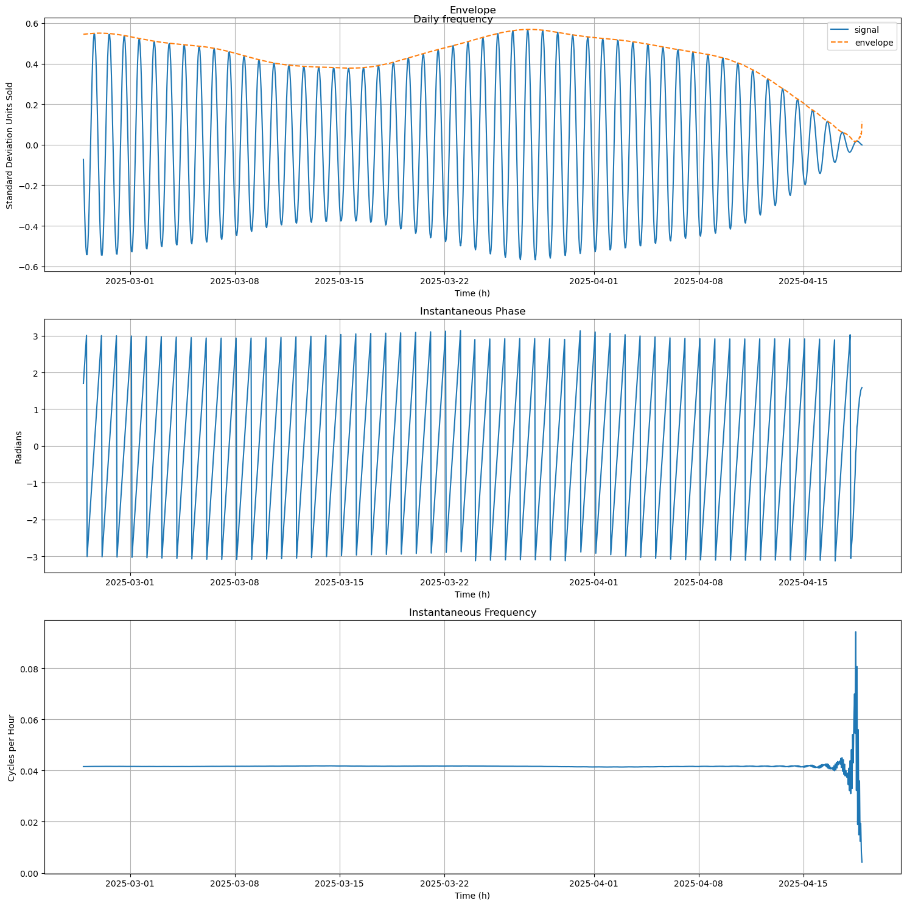
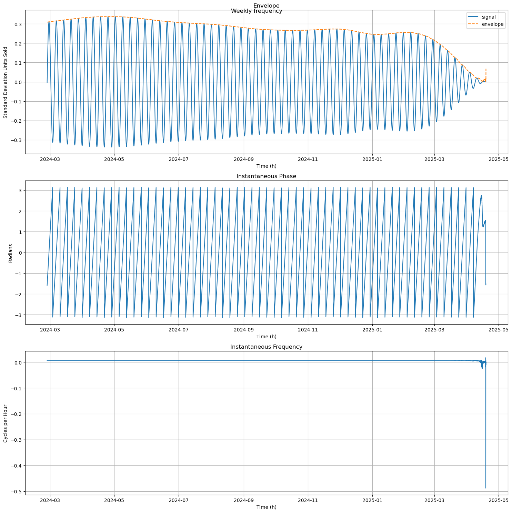
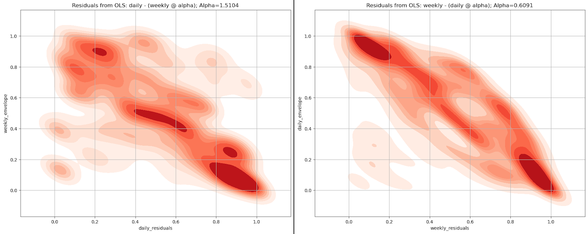
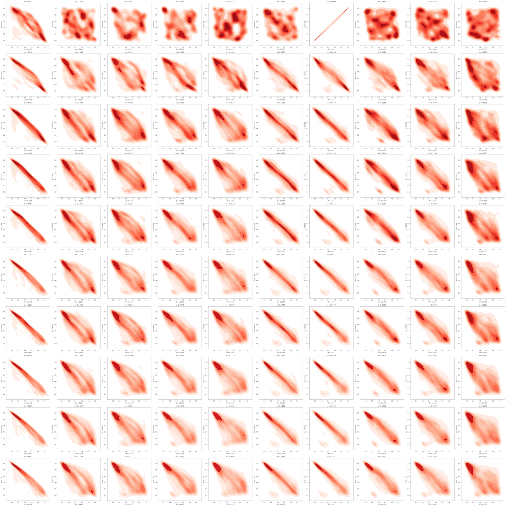

---
header-includes:
  - \usepackage{float}
  - \floatplacement{figure}{H}
  - \usepackage[export]{adjustbox}
  - \let\includegraphicsbak\includegraphics
  - |
    \renewcommand*{\includegraphics}[2][]{%
      \includegraphicsbak[frame,keepaspectratio,max width=\textwidth,#1]{#2}%
    }

geometry: margin=0.75in
papersize: a4paper
fontsize: 11pt
wrap: none
mainfont: "Liberation Serif"
sansfont: "Liberation Sans"
monofont: "Hack"
---

# Hospitality Sales: A Deep Dive - Part IV

## Introduction
This series of articles is a semi-formal walkthrough exploring some of the very intricate and colourful dynamics of hospitality (hospo), especially food and beverage (F&B). All data sourced is proprietary.

We made it to the end! In Part I we were introduced to a dataset of hospitality sales alongside that venue's weather measurements. Simple applications of linear algebra and statistics helped us narrow down those weather regressors to just a couple, `["relative_humidity_2m_percent", np.log1p("precipitation_mm")]`. In Part II, we meditated over the temporal dynamics of univariate sales (`y`) and yet again, linear algebra helped us develop a theoretical estimate of the sales model - albeit somewhat incomplete. In Part III we leveraged some pretty dope signals processing theory and surgically unravelled our sales' periodicities, completing our theoretical model and collapsing potentially astronomical condition numbers to near-optimal.

In Part IV we're going to ever so slightly extend our conclusion from Part III before wrapping up our series with the results of this R&D that we at Quantaco experienced.

### Broad Strokes
Briefly, in this part we're going to cover:
1. Analytic Signals.
2. Nonlinear Modelling.
3. Final Results & Discussion.

As a refresher, this was our original dataset:


And at the end of Part III, we had this final model:
$$
  y_t =
      \alpha
    + \phi y_{t-1}
    + \sum_{h \in H} \text{Holidays}_h(t)
    + \sum_{f \in \left[ 24, 168 \right]} \text{Fourier}_f(t)
    + \gamma \; s_t
    + \vec{\rho}^{\top}\text{Weather}_t
    + \epsilon_t \;;
$$

\begin{align*}
  s_t &= \mu_h \left[ y \mid \text{hour-of-week}(t) \right] \newline\\
  \text{Weather}_t &=
    \begin{bmatrix}
      \text{relative humidity}_t \\
      \log(\text{precipitation}_t) \\
    \end{bmatrix}
\end{align*}

When exercising a surrogate of this model with OLS, we saw residuals with some heavy tails and skew. Before we end this series, let's inspect this just a bit further.

## Analytic Signal
Now that we have a solid grasp of our fundamental frequencies, we can use another really neat signals processing technique and observe how these specific seasonalities of ours behave over time. Pole/zero analysis gave us a good read as to whether we have non-unit root or unitary seasonality, but supplementing this with a glimpse into our how our dominant FFT frequencies actually behave _over time_ - as in, literally against raw sales over time - is invaluable. To do this, we need a way of measuring the strength (amplitude) of a specific period (frequency) at each period in time - or in other words, we need a way to cancel out other frequencies over time except for the one we're interested in. To help us out, we have the analytic signal:
$$
  X_+(t) = x(t) + i H\{x(t)\}
$$

Where $X_+(t)$ is a complex function whose magnitude and angle encode the _instantaneous_ amplitude and phase respectively. In contrast, our FFT gave us _global_ amplitude and phase over the entire frequency spectrum nonspecific to any $t$; and our bicoherence plots showed us that we do have frequency couplings, but not their behaviour over time. From the form of $X_+(t)$, we can see that the real component is the original signal, and the complex component is $i$ times the [Hilbert transform](https://en.wikipedia.org/wiki/Hilbert_transform). There's a bit to unpack here, starting with the Hilbert transform $H\{x(t)\}$.

By itself, $H\{x(t)\}$ doesn't do much: in the frequency domain, it just imparts a phase shift of $\pm90^{\circ}$ to every frequency component in a given signal, the sign of the shift being determined by the sign of the frequency. It's formulated using [Cauchy's Principal Value](https://en.wikipedia.org/wiki/Cauchy_principal_value) (PV) approach, which itself is just a very specific manipulation of integral limits to avoid integrating over a singularity (much like L'Hopital's rule in differential calculus that helps us resolve differentiating over singularities, or areas where our denominator is 0). Using the PV, the Hilbert transform is:
$$
  H\{u(t)\} =
    \frac{2}{\pi}
    \lim_{\epsilon \to 0} \int_{\epsilon}^{\infty} \frac
      {u(t-\tau) - u(t+\tau)}
      {2\tau}
    \; d \tau
$$

Where $\tau$ is the entire length of our time series. Basically, for each $t$ in the raw data we difference both halves of the signal just before and after $t$, weight each result by $1/\tau$ so that closer points count more (and is where we get our $\pm90^{\circ}$ phase shift from), and then integrate over all those differences from $\tau=0$ out to $\infty$. Because we're using Cauchy's PV, the integral converges nicely despite the singularity in $1/\tau$ when $\tau=0$.

But _why_ is it that we're doing all of rotation business? Is this really necessary to just single out frequencies and map them back to the time domain? Well, it turns out that to get what we call an "analytic signal" - to have a way to inspect our amplitude over time for a given frequency - we need to kind of cancel out _all_ negative frequencies in our real-valued time series but leave the positive ones untouched for a couple of good reasons:
1. Real-valued time series are Hermitian, i.e. they're symmetric around the imaginary axis. There's no point in keeping both positive and negative frequencies.
2. We want only one projection for a specific frequency, not two. Since real signals are Hermitian, there is no way to uniquely define _the_ instantaneous phase and amplitude of a multi‑component waveform. With only one side, the complex argument and magnitude are bijective onto a single phase and envelope.

So given that all we want to do is phase-rotate everything by $\pm90^{\circ}$ but leave the amplitude alone, there's only one linear time-invariant (LTI) filter that does this exactly:
$$ h(\tau) = \frac{1}{\pi \; \tau} $$

Which is known as the [Cauchy kernel](https://en.wikipedia.org/wiki/Cauchy_kernel). But since that thing isn't integrable around $\tau=0$, we instead apply Cauchy's Principal Value to arrive at the formulation of $H\{x(t)\}$ we have here. Apply $H\{x(t)\}$ once, and we rotate all frequency components by $90^{\circ}$ (positive components by $-90^{\circ}$, negative components by $+90^{\circ}$). Apply $H\{x(t)\}$ twice, and we rotate all frequency components by $90^{\circ} + 90^{\circ} = $180^{\circ}$ (positive components by $-180^{\circ}$, negative components by $+180^{\circ}$), giving us the negative of our original signal.

Once we have $H\{x(t)\}$ (applied once), we multiply it by $i$ and add the original signal back. A few things are going on here, which we'll treat mathematically in the frequency domain. We'll denote the Fourier Transform of $x(t)$ as $X(f)$:

1. The Fourier Transform of the Hilbert transformation $H\{x(t)\}$ is given by:
   $$
     \text{FFT}\{H\{x(t)\}\} = -i \cdot \text{sgn}(f) \cdot X(f)
   $$

   Where $\text{sgn}(f)$ is the signum function, which is -1 for negative frequencies, +1 for positive frequencies, and 0 for zero frequency.

2. Now let's work out the Fourier Transform of the entire analytic signal, $X_+(t)$:

    \begin{align*}
      X_+(t) &= \text{FFT}\{x(t) + iH\{x(t)\}\} \\
      X_+(t) &= \text{FFT}\{x(t)\} + i \cdot \text{FFT}\{H\{x(t)\}\} \\
      X_+(t) &= X(f) + i \cdot (-i \cdot \text{sgn}(f) \cdot X(f)) \\
      X_+(t) &= X(f) + \text{sgn}(f) \cdot X(f)
    \end{align*}


3. Finally, when we multiply by $i$ and add the original signal back:
    - For positive frequencies ($f > 0$), $\text{sgn}(f) = 1$, so $X_+(t) = X(f) + X(f) = 2X(f)$.
    - For negative frequencies ($f < 0$), $\text{sgn}(f) = -1$, so $X_+(t) = X(f) - X(f) = 0$.

Multiplication by $i$ rotates the multiplicand by $90^{\circ}$ which, when applied to $H\{x(t)\}$, restores positive frequency components ($-90^{\circ}+90^{\circ} = 0^{\circ}$) and shifts negative ones an additional $+90^{\circ}$ ($90^{\circ}+90^{\circ} = 180^{\circ}$) resulting in their negation - they don't cancel out, they become positive. By then adding back the original signal, real amplitudes are doubled and the negatives cancel themselves out; multiplying by $i$ simply primes the negatives for cancellation.

So by simply phase-rotating everything by $\pm90^{\circ}$, multiplying by $i$ and adding our original signal back, we can catch a glimpse of something we can't otherwise see: instantaneous amplitude, phase, and frequency for a specific _narrowband component_. Wait, what's this narrowbanding thing? If we go ahead and compute the analytic signal over our entire raw sales data, we'd see noise since every single frequency will contribute. If we instead single out a specific frequency, e.g. the daily frequency $\frac{1}{24} \approx 0.0417$ (if we "narrowband" around the daily), with, say, a Butterworth filter, we can dial in onto the clean curve of the daily frequency's strength over time. Likewise for the weekly (168h) and all other standout frequencies in our FFT.

Let's look at the daily first. In the diagram, I've narrowbanded with a tolerance of $\pm 0.05$, $\implies \frac{1}{24} \approx 0.0417 \pm 0.05 = (0.0412, 0.0422)$. Since our raw data also has 17,999 records, the total analytic signal is just a solid block - I've limited my plotting function to using only the most recent 1250 records (the most recent 1250 hours worth of sales). Finally, we should expect some boundary effects from numerical artefacts:



Take a moment. Ain't that just grand? In the topmost graph, the orange curve is the envelope - or instantaneous amplitude - of the daily frequency over time. When it peaks, it means that our day-to-day sales swings are the most pronounced (the daily high(s) and low(s) differ by a lot). When it dips, sales are flatter.

This is _real_, and is one of the many ways we at Quantaco maintain analytical surveillance over our clients' operations: between the 13th to the 15th of March, the daily frequency of our sample dataset dipped significantly meaning sales should have been muted - and they were for that week. Between the 26th and 28th of March, the daily frequency peaked, and indeed on those days sales were the maximal for the week. This representation doesn't just tell us how our daily frequency affects sales' evolution, but when we see a:
- Solid envelope, i.e. a straight line tracing each crest with no waxing & waning, it means we have non-unit root for that seasonality.
- Waveform envelope, i.e. a line that waxes and wanes along with the crests, it means we have a unit root for that seasonality.

In this case, the envelope suggests that our daily seasonality has a unit root - and this agrees with our poles' radii from part 2: the daily frequency had radii of $0.99972$; very, very close to 1.

But what of the other two graphs? The second one, instantaneous phase, is really a brilliant thing to look at: it shows us _where_ in the daily cycle we are. Each zero of that corresponds to whenever the daily cycle resets, say 12:00AM AEST, a peak in the blue daily frequency curve in the top graph. That it's a classic sawtooth means it ramps linearly through $-\pi \to +\pi$ every 24 hours, then wraps back to $-\pi$ the next day. The point where it crosses zero is our "daily peak" _in phase space_, regardless of actual clock time. If there were any distortion (ramp line dragging or speeding up, slower or faster ramps) it would tell us that the daily cycle is stretching or contracting, and this actually does happen: say some event takes place and sales drag on until 12:15AM or 12:30AM AEST, ever so slightly skewing the daily peak from 12:00AM further into the next day. That slight distortion will show up clear as day in the instantaneous phase graph and clearly indicate to us that the daily sales' strength is shifting. Any operations dependent on calendar time would gain immediate intel that a skew is underway.

The last graph is the first derivative of instantaneous phase, instantaneous frequency. For a theoretically perfect 24h-period cycle, it'd sit at exactly $\frac{1}{24}$ cycles per hour; and in our case, it does; again, it means for this sample period there's no distortion in the daily cycle. If we saw a drift here, since this is the rate of change of phase, it'd signal something speeding up or contracting our daily rhythm - like a flash sale or something.

Let's look at the weekly cycle! Here too I've narrowbanded to $\frac{1}{168}\pm0.05 \implies (-0.0440, 0.0559)$, but since we're looking at a slower-moving waveform, I've extended the data limit to the most recent 10,000 records (the most recent 10,000 hours worth of data):



Now this is interesting: in small sections, the weekly envelope is indeed a solid line across each crest - again, in _relative_ agreement with our poles' radii ($0.999163$; smaller than the daily). However, in the graph - because of the extended data limit - we can see a peak in the envelope around the first week of April 2024, followed by a slow decline - the weekly period too has somewhat of a unit root, it just takes a very long time to show it. Instant phase and frequency here also show nothing abnormal (except for numerical artefacts around the edges).

So what does all of this tell us? From the end of Part III, our exemplar OLS model had residuals that were heavily skewed and leptokurtic. Besides the fact that we omitted important parts of our theoretical model when exercising this surrogate one (we didn't include a trend, nor holidays, nor a seasonal moving average), what we see here is that our seasonalities themselves wax and wane over time - something we inferred from our poles - drilling home the point that a simple one-coefficient-fits-all type approach with standard OLS won't cut it. Even though our periodic roots are not an exact 1, they're close enough to accumulate shocks and have them decay slowly enough that they appear stochastic over time this way. We'd need to reformulate our model to account for this kind of quasi-deterministic seasonality that evolves over time, something along the lines of [`statsmodels.UnobservedComponents`](https://www.statsmodels.org/dev/generated/statsmodels.tsa.statespace.structural.UnobservedComponents.html).

We can get a good insight into doing this by treating the envelopes themselves as univariate time series and inspecting them - and for this specific sample time series of ours, _the analytic envelopes are random walks_. The ACFs of both the daily and weekly envelopes indicated a very strong lag 1 correlation (naturally, equivalent to the pole of that specific period), fitting simple AR orders all snapped the coefficients of `ar.L1` to $1$; the best performing AR models were actually $I(1)$. So thus far, for our sample time series, our model now becomes:
$$
  y_t =
      \alpha
    + \phi y_{t-1}
    + \sum_{h \in H} \text{Holidays}_h(t)
    + \sum_{f \in \{24, 168\}} \sum_{k=1}^{K_f} \text{Fourier}_{f,k}(t)
    + \gamma \; s_t
    + \vec{\rho}^{\top} \text{Weather}_t
    + \epsilon_t \;;
$$

\begin{align*}
  s_t &= \mu_h \left[ y \mid \text{hour-of-week}(t) \right] \newline\\
  \text{Weather}_t &=
    \begin{bmatrix}
      \text{relative humidity}_t \\
      \log(\text{precipitation}_t) \\
    \end{bmatrix} \newline\\
  \text{Fourier}_{f,k}(t) &=
    \begin{bmatrix}
      \beta_{f,k,t}^{(1)} \\
      \beta_{f,k,t}^{(2)}
    \end{bmatrix}^{\!\top}
    \cdot
    \begin{bmatrix}
      \sin \frac{2\pi k t}{f} \\
      \cos \frac{2\pi k t}{f}
    \end{bmatrix}\\
    &=
    \vec{\beta}_{f,k,t}^{\top}
    \cdot
    \begin{bmatrix}
      \sin \frac{2\pi k t}{f} \\
      \cos \frac{2\pi k t}{f}
    \end{bmatrix} \newline\\
  \vec{\beta}_{f,k,t} &=
      \Psi_f \; \vec{\beta}_{f,k,t-1}
    + \vec{\eta}_{f,k,t}, \quad
    \vec{\eta}_{f,k,t} \sim \mathcal{N}(0, Q_f)
\end{align*}

Where:
- $\vec{\beta_{f,k,t}}$ is a 2D vector of time-varying coefficients - one $\beta$ each for the sine and cosine harmonics - at frequency $f$ and harmonic $k$.
- $\phi_f$ is a $2 \times 2$ matrix governing the evolution of $\vec{\beta}_{f,k,t}$ over time; very close to the identity matrix to reflect a weakly-damped random walk.
- $Q_f$ is the $2 \times 2$ process-noise covariance, controlling the variability in evolution of the harmonic components. This just helps us model any correlation between the two envelopes (for reference, in Part II §Whitened Copulae, I had provided code for generating noisy sines with correlation. $Q_f$ is simply the matrix form of that).

Basically, we're now representing our seasonalities themselves as time-varying random walks. This kind of form would be solved using Kalman filtering with MLE; in fact, this entire form can actually be represented as a stochastic differential equation (SDE) such that we generalise over any kind of time interval, rather than being limited to hourly $\Delta t$ increments. Temporal generalisation notwithstanding, this model is still only specific to the time series under study. But there's still...something...

## But Something's Amiss
We've significantly added to our theoretical model from the start of Part 2, and indeed, this one now seems to be quite a robust and production-grade fit. But we'd be remiss if we were to call it quits here; there's this nagging feeling of "something just isn't right". Let's address the elephant in the room: _is a linear model the best we can do?_ Or, in other words, why is our model purely linear? Notice:
1. Pearson correlation showed us coefficients up to a maximum of just $\approx 0.55$; copulae between sales and weather, on the other hand, showed monotonic and well-behaved relationships. What about the other 45%?
2. We can even see this kind of nonlinear behaviour between weather and sales in the discretised graphs: `apparent_temperature_celsius` is clearly sinusoidal across its own values vis-a-vis sales, `temperature_2m_celsius` is perhaps logarithmic, and `precipitation_mm` shows two utterly fascinating distinct regimes: one that reduces over time, and one that increases over time (perhaps linearly separable regimes, but that's a different discussion - fun fact, the two regimes of `precipitation_mm` bear a resemblance to the Desmos graph for $\operatorname{floor}\left(x\right)-x+1$).
3. From Part 3, we saw that 75% of our seasonalities interact nonlinearly (MSC only explained ~25%, and even the best OLS surrogate only captured ~80% with curious residual behaviour) - a dynamic _separate_ from the random walk we saw the envelopes take - yet we have only linear interaction terms in our current model. Add to this the harmonic ladders we saw forming between all our seasonal periods, and it's clear that our frequencies aren't just straightforward trigonometric sums; there's a lot of amplitude modulation and quadratic phase coupling going on.

All of this screams out the fact that we have more than sufficient evidence in favour of significant nonlinearity between weather and within sales - why is our model only linear? Before we answer this question, let's just take a slightly closer look at our analytic envelopes. We know there's nonlinearity involved, and the harmonic ladder also tells us we have some jazzy stuff happening. Is there any dependence between the envelopes - any of them - and weather? Using Mutual Information Regression to try and explain an envelope from weather regressors gives us these results:

|                                   | daily_envelope_mir | weekly_envelope_mir |
| --------------------------------- | :----------------- | :------------------ |
| apparent_temperature_celsius      | `0.063808`         | `0.101008`          |
| cloud_cover_percent               | `0.024833`         | `0.062531`          |
| dew_point_2m_celsius              | `0.088545`         | `0.133781`          |
| precipitation_mm                  | `0.005694`         | `0.017049`          |
| precipitation_probability_percent | `0.002387`         | `0.017891`          |
| rain_mm                           | `0.002853`         | `0.003408`          |
| relative_humidity_2m_percent      | `0.041587`         | `0.054031`          |
| showers_mm                        | `0.007736`         | `0.017400`          |
| temperature_2m_celsius            | `1.415340`         | `2.600006`          |
| visibility_m                      | `0.284535`         | `0.500147`          |
| wind_speed_10m_kmh                | `0.041371`         | `0.042109`          |
| sales                             | `0.020830`         | `0.016177`          |

Clearly, temperature has the most nonlinear effect on modulating sales' seasonal harmonics (followed by visibility which we did touch upon earlier: perhaps it's a case of 'if I can see the bar, I can drink at it' or similar), which is interesting because we did see some kind of nonlinear relationship from the discretised graphs in Part I, Figure 6 but not a lot. What about envelope vs. envelope? This is where it gets interesting: recall that MSC between the daily and the weekly envelopes is ~25%, meaning 25% of their interaction is linear. Rather than looking at a raw copula betwixt the two, if we OLS project one envelope onto another and _then_ plot just the nonlinear copula, we see this majestic looking thing:

```python
d_alpha, d_resid = ols_whiten(weekly_envelope.reshape(-1, 1), daily_envelope)
w_alpha, w_resid = ols_whiten(daily_envelope.reshape(-1, 1), weekly_envelope)
# plot copulae for both d_resid vs. weekly_envelope & w_resid vs. daily_envelope
```



Which is simply fascinating: not only are our weather regressors monotonic with sales in their nonlinearity, _so are our envelopes_ between themselves and, by proxy, so are our seasonalities. By removing their linear component, we stumbled upon the fact that their underlying nonlinear structure is surprisingly well-behaved. This is fantastic news for our modeling: it implies that the nonlinearity we need to capture is not arbitrarily complex. Our problem became a lot more tractable! And it gets even better: we know we have a harmonic ladder between the daily and weekly frequencies at play. If we simply go just one step further and repeat this residualised-copula plotting process for all involved harmonics (10 weeklies and 10 dailies, giving us 100 plots), we actually see something really fascinating:



That image shows all residualised copulae for the entire 10-harmonic-each ladder of daily and weekly frequencies from our sales, `y`. From left to right, top to bottom, the top left most plot is the residualised copula between the first daily and first weekly harmonic. The second plot to the right of that is the residualised copula beween the first daily harmonic and the second weekly harmonic. Thus, the entire topmost first row contains the residualised copulae between the first daily harmonic, $f=0.0417$ (24h period), and all 10 weekly harmonics. The second row contains the residualised copulae between the second daily harmonic, $f=0.0833$ (12h period) and all 10 weekly harmonics. So on, and so forth for subsequent rows.

Besides them all looking like galaxies, we can see something really neat: the more harmonics we include, the better behaved the pairwise relationship is; the less interaction there is remaining uncaptured. As discussed previously however, we can't simply slap on 10 harmonics of both the daily and the weekly because we'd explode in condition number. If we try to relate this back to what we saw in Part 3 with our surrogate model (6 weeklies and 6 dailies capture 80% linearity as per MSC), we can see that the copula plot in the 6th row, 6th column is also very well behaved (no different from its neighbours yes, but that's really irrelevant) in its monotonicity. In fact, the entire columns of 6- and 7-weekly harmonics are the neatest copulae in the entire image, reinforcing our finding from Part 3 that 6 weeklies are pretty good with some combination of dailies.

So what do we do with all of this information? We know now that weather regressors are well-behaved but nonlinear with sales, that temperature influences sales' seasonalities (via their analytic envelopes), that our seasonalities are well-behaved but nonlinear with each other, and also that this nice behaviour extends across the harmonic ladder. All of these layers of "monotonic but nonlinear-dependence" tell us that the missing piece isn't _whether_ nonlinearity exists, but _how_ to flexibly model it without hand-crafting dozens of cross-interaction terms. Rather than manually engineering every sine $\times$ sine, cosine $\times$ cosine, or spline surface, ad infinitum, a flexible yet parsimonious way forward is to slap a tiny neural net inplace of the Fourier and weather terms.

Since our copulae are well behaved, a teeny neural net (NN) with just 1 or 2 hidden layers and monotonic activation functions (like `LReLU`) would be more than capable of handling our dataset. In fact, we get quite some flexibility now that we're dealing with NNs: we can have end-to-end autograd for *all* involved parameters, optimising $\alpha$, $\phi$, the number of lags $L$ instead of a constant $t-1$; we can replace the fixed Fourier terms with `nn.Parameter`s that estimate the number of Fourier harmonics for a specific frequency, then narrowband those frequencies out to get their analytic envelopes and use them as downstream regressors deeper in the NN; we can let autograd optimise the length of the lookback period to use for the baseline MA $s_t$ (4 weeks ago? 2 weeks ago? etc.); and if necessary, we can also let the NN figure out the evolution of each seasonality itself, ridding us of a fixed stochastic evolution law and introducing additional noise parameters $\mu_{\eta}$ and $\sigma_{\eta}$ that control $\eta$ in $\vec{\beta}_{f,k,t}$. We can even use the autograd-discovered frequency terms from the Analytic Hilbert kernels in phase-based surveillence, rather than depending on an eyeballed set of narrowbanded frequencies. In fact, everything we've seen so far with regards to our seasonalities is something that, say, a [complex-valued neural network](https://medium.com/@quantaco_rahuls/differentiating-complex-valued-attention-68cd43628c55) just might excel at exploiting.

There is much debate that can go around regarding the neural architecture (what about recurrence? What about convolutions? What about attention? What about an RL policy?), however suffice to say, this is clear direction for further research. We're going to wrap this series up and simply reformulate our model using the (real-valued, for this discussion's sake) generic "NN" simply as described above, minus the stochastic evolution law (simply because it's rather difficult to notate this neatly). This gives us our final theoretical _future_ model:

$$
  y_t =
      \alpha_{\theta}
    + \sum \limits_{i=1}^{L_{\theta}} \vec{\phi}_{i \mid \theta}^{\top} \; \vec{y}_{t-i}
    + \sum_{h \in H} \text{Holidays}_h(t)
    + \textbf{NN} \Bigl(
        X_{f,k \mid \theta}^+(t),\;
        s_{t \mid \theta},\;
        \text{Weather}_t
      \Bigr)
    + \varepsilon_t \;;
$$

\begin{align*}
  \vec{y}_{t-1 : t-L_{\theta}} &= \begin{bmatrix}
    y_{t-1} \\
    y_{t-2} \\
    \vdots  \\
    y_{t-L_{\theta}}
    \end{bmatrix} \\
  \text{Holidays}_h(t) &= \begin{cases}
    1, & \text{if }\; t\; \text{ is a holiday} \\
    0, & \text{otherwise}
  \end{cases} \\
  s_t &=
    \frac{1}{\lfloor N_{\theta} \rfloor}
    \sum \limits_{i=1}^{\lfloor N_{\theta} \rfloor} y_{t-i \cdot 168}
\end{align*}

Where $\alpha_{\theta},\; L_{\theta},\; \phi_{i \mid \theta},\; \lfloor N_{\theta} \rfloor$ are all `nn.Parameter`s - not explicitly part of the neural network $\textbf{NN}$ as a layer but separate autograd parameters, though functionally they work the same - controlling for:
- Level ($\alpha_{\theta}$).
- The number of AR lags to include ($L_{\theta}$). We add lagged versions of `y` up to some autograd-discovered maximum lag value, $L_{\theta}$.
- The AR coefficients for each lag ($\phi_{i \mid \theta}$).
- The lookback period for the baseline moving average ($\lfloor N_{\theta} \rfloor$), where $N$ is an integer (hence, the floor operation).
- $X_{f,k \mid \theta}^+(t)$ is rather special: this is the Hilbert transform of the input sales time series, but the _frequencies (and their harmonics) to narrowband around_ are what are optimised via autograd, notated with $X_{f,k}$, where $f$ is a frequency and $k$ is a harmonic.
- $\text{Holidays}_h(t)$ is a one-hot encoded matrix: $1$ wherever time $t$ is a holiday, $0$ otherwise.
- Finally, $\text{Weather}_t$ are our weather regressors, but this time we use *all* of them without any nonlinear transformations being applied.

The forward pass here is equally simple: the input tensor contains raw sales, a one-hot encoded holidays dataset, and weather regressors. From raw sales, we extract the analytic signal using randomly-initialised (and to-be optimised) frequencies and harmonics; we generate the baseline MA using a randomy-initialised (and to-be optimised) lookback period; we also use a randomly-initialised (and to-be optimised) number of lags for our AR process. We slap all of these extracted features onto our existing featureset of holidays and weather, and pass it through the NN. Batch normalisation ensures stability throughout training, naturally we'd monitor our condition numbers per layer, and just before our output layer we just have a single `nn.Parameter` to add onto estimated sales: $\alpha_{\theta}$. We measure against `nn.MSELoss`, cue the backward pass, rinse and repeat.

## Final Results
We now have a pretty solid grasp of what's in our innocuous looking sales data and its weather covariates. When we started this project at Quantaco, we selected 16 specific venues, their areas, and categories of products out of our 300+ combinations to research. For each of the 16 pilots, the same process documented over this series was followed save for a slightly different modelling approach and some additional minor checks and balances along the way to alleviate analysis paralysis, and to ensure that we actually had something viable which _all_ stakeholders valued. The initial suite of models developed was severely ill-conditioned, but performed relatively well over a moving average baseline showing promise in the approach.

At the end of this R&D cycle we had a robust pipeline for automated feature extraction effective over all of our time series, dissected everything there was to dissect from each of them, and integrated salient surveillence mechanisms over our data (and, consequently, client operations) so that we're prepared to step in and help out preemptively before issues arise on the ground. Something we didn't include in this series of articles but was vital to our process of model selection was error measurement with a rolling-window forecast over time, so that we could quantify the mean and standard deviation of out-of-sample RMSE rather than reporting a single error metric hardcoded for a specific dataset. All results reported here are averages garnered over rolling forecast windows, not point results. The results of this R&D gave us a suite of models that:
- Are 14.23% lower in RMSE versus baseline (6.27% lower vs. the previous fleet).
- Have a reduction in forecast standard deviation by 15.28% versus baseline (6.29% tighter vs. the previous fleet).
- Are a whopping $10^{12}$ smaller in condition number, down to the single digits (the maximum condition number we have now is ~6).
- Improved Food performance by 11.31% versus baseline (5.66% better vs. the previous fleet).
- Improved Beverage performance by 16.17% versus baseline (6.67% better vs. the previous fleet).

Our best performing venue is 39.73% better versus baseline (26% better than the previous fleet), our worse performing model is at par with the same model from the previous fleet, and last but certainly not the least, we now have a _very_ explainable pipeline and suite of models to boot. That alone pays dividends far greater than any naive lowest-error only model ever could, and goes to show that at Quantaco, we value explainability more than any highest-accuracy black-box model.

Article sequence completed, have a nice day!
